# ModelSDK Go - Architecture

This document describes the overall architecture of the ModelSDK Go project, a Go-native library for reading and modifying Mendix application projects (`.mpr` files).

## High-Level Architecture

```mermaid
graph TB
    subgraph "User Interface"
        CLI[mxcli CLI]
        API[Go API]
        VSCODE[VS Code Extension]
    end

    subgraph "MDL Layer"
        REPL[REPL Interface]
        LSP[LSP Server]
        EXEC[Executor]
        PARSER[ANTLR4 Parser]
        AST[AST Nodes]
        VISITOR[AST Visitor]
        CATALOG[Catalog]
        LINTER[Linter]
    end

    subgraph "High-Level API"
        HLAPI[api/]
        DMAPI[DomainModelsAPI]
        MFAPI[MicroflowsAPI]
        PGAPI[PagesAPI]
        ENUMAPI[EnumerationsAPI]
        MODAPI[ModulesAPI]
    end

    subgraph "SDK Layer"
        SDK[modelsdk.go]
        DM[domainmodel]
        MF[microflows]
        PG[pages]
        MODEL[model]
        WIDGETS[widgets]
    end

    subgraph "External SQL"
        SQLPKG[sql/]
        SQLCONN[Connection Manager]
        SQLQUERY[Query Engine]
        SQLIMPORT[Import Pipeline]
        SQLGEN[Connector Generator]
    end

    subgraph "Backend Layer (mdl/backend/)"
        BACKEND[FullBackend interface]
        MPRBACK[MPR Backend impl]
        MOCKBACK[Mock Backend]
        PAGEMUT[PageMutator]
        WFMUT[WorkflowMutator]
        FACTORY[BackendFactory]
    end

    subgraph "Shared Types (mdl/types/)"
        TYPES[Domain types]
        BSONUTIL[bsonutil/]
    end

    subgraph "Storage Layer"
        READER[MPR Reader]
        WRITER[MPR Writer]
        BSONP[BSON Parser]
    end

    subgraph "File System"
        MPR[(MPR File)]
        CONTENTS[(mprcontents/)]
        EXTDB[(External DBs)]
    end

    CLI --> REPL
    CLI --> LSP
    API --> HLAPI
    API --> SDK
    VSCODE --> LSP
    HLAPI --> SDK
    HLAPI --> READER
    HLAPI --> WRITER

    REPL --> EXEC
    LSP --> EXEC
    EXEC --> PARSER
    PARSER --> AST
    AST --> VISITOR
    VISITOR --> AST
    EXEC --> BACKEND
    EXEC --> SQLPKG
    EXEC --> CATALOG
    EXEC --> LINTER

    BACKEND --> PAGEMUT
    BACKEND --> WFMUT
    MPRBACK --> BACKEND
    MOCKBACK --> BACKEND
    FACTORY --> MPRBACK

    SDK --> DM
    SDK --> MF
    SDK --> PG
    SDK --> MODEL
    SDK --> WIDGETS
    SDK --> READER
    SDK --> WRITER

    MPRBACK --> READER
    MPRBACK --> WRITER
    MPRBACK --> TYPES
    MPRBACK --> BSONUTIL

    SQLPKG --> SQLCONN
    SQLPKG --> SQLQUERY
    SQLPKG --> SQLIMPORT
    SQLPKG --> SQLGEN
    SQLCONN --> EXTDB

    READER --> BSONP
    WRITER --> BSONP
    READER --> MPR
    READER --> CONTENTS
    WRITER --> MPR
    WRITER --> CONTENTS
```

## Package Structure

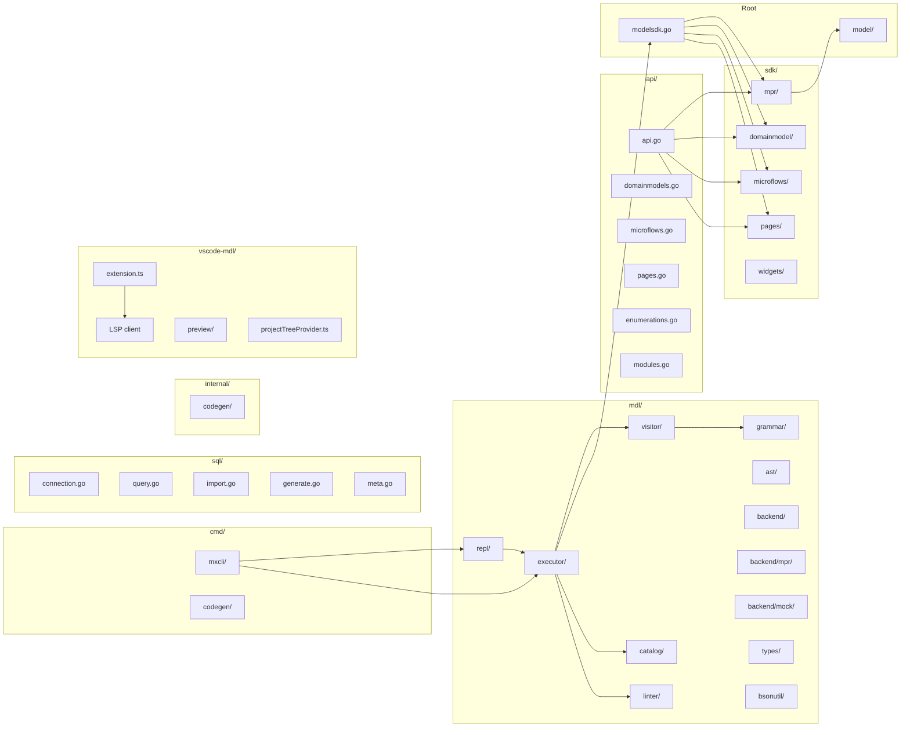

## Component Details

### 1. Command Layer (`cmd/`)

| Package | Purpose |
|---------|---------|
| `cmd/mxcli` | CLI entry point using Cobra framework; includes LSP server, Docker integration, diagnostics |
| `cmd/codegen` | Metamodel code generator from reflection data |

Key CLI subcommands:

| Subcommand | File | Purpose |
|------------|------|---------|
| `exec` | `cmd_exec.go` | Execute MDL script files |
| `check` | `cmd_check.go` | Syntax and reference validation |
| `lint` | `cmd_lint.go` | Run linting rules |
| `report` | `cmd_report.go` | Best practices report |
| `test` | `cmd_test_run.go` | Run `.test.mdl` / `.test.md` tests |
| `diff` | `cmd_diff.go` | Compare script against project |
| `sql` | `cmd_sql.go` | External SQL queries |
| `lsp` | `lsp.go` | Language Server Protocol server |
| `init` | `init.go` | Project initialization |
| `docker` | `docker.go` | Docker build/check/OQL integration |
| `diag` | `diag.go` | Session logs, bug report bundles |

### 2. MDL Layer (`mdl/`)

The MDL (Mendix Definition Language) layer provides a SQL-like interface for querying and modifying Mendix models.

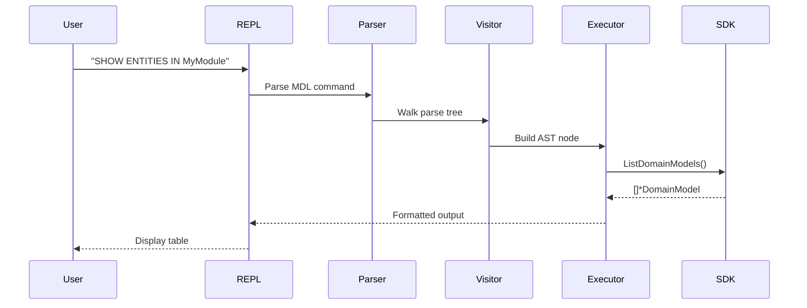

| Package | Purpose |
|---------|---------|
| `mdl/grammar` | ANTLR4 lexer/parser (generated from MDLLexer.g4 + MDLParser.g4) |
| `mdl/ast` | AST node types for MDL statements |
| `mdl/visitor` | ANTLR listener that builds AST from parse tree |
| `mdl/executor` | Thin orchestrator: parses AST, calls `ctx.Backend.*`, formats output. **No `sdk/mpr` imports.** |
| `mdl/backend` | Domain-specific backend interfaces (`FullBackend`, `PageMutator`, `WorkflowMutator`, `BackendFactory`) |
| `mdl/backend/mpr` | MPR-backed implementation of all backend interfaces; owns all BSON mutation logic |
| `mdl/backend/mock` | `MockBackend` with Func-field injection for unit testing without a `.mpr` file |
| `mdl/types` | Shared domain types (`NavigationDocument`, `JavaAction`, `JsonStructure`, EDMX/AsyncAPI parsers, ID utilities) — no `sdk/mpr` dependency |
| `mdl/bsonutil` | CGO-free BSON ID utilities (`IDToBsonBinary`, `BsonBinaryToID`, `NewIDBsonBinary`) |
| `mdl/catalog` | SQLite-based catalog for querying project metadata (entities, microflows, references, permissions, source code) |
| `mdl/linter` | Extensible linting framework with built-in rules and Starlark scripting support; includes report generation |
| `mdl/repl` | Interactive REPL interface |

### 3. High-Level API Layer (`api/`)

The `api/` package provides a simplified, fluent builder API inspired by the Mendix Web Extensibility Model API.

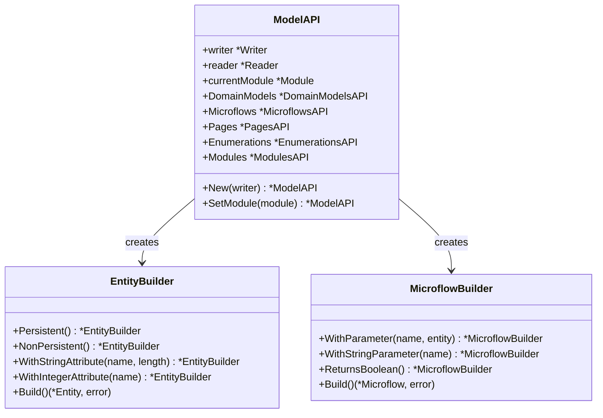

| Package | Purpose |
|---------|---------|
| `api/api.go` | ModelAPI entry point with namespace access |
| `api/domainmodels.go` | EntityBuilder, AssociationBuilder, AttributeBuilder |
| `api/enumerations.go` | EnumerationBuilder, EnumValueBuilder |
| `api/microflows.go` | MicroflowBuilder with parameters and return types |
| `api/pages.go` | PageBuilder, widget builders |
| `api/modules.go` | ModulesAPI for module retrieval |

### 4. SDK Layer (`sdk/`)

The SDK layer provides Go types and APIs for Mendix model elements.

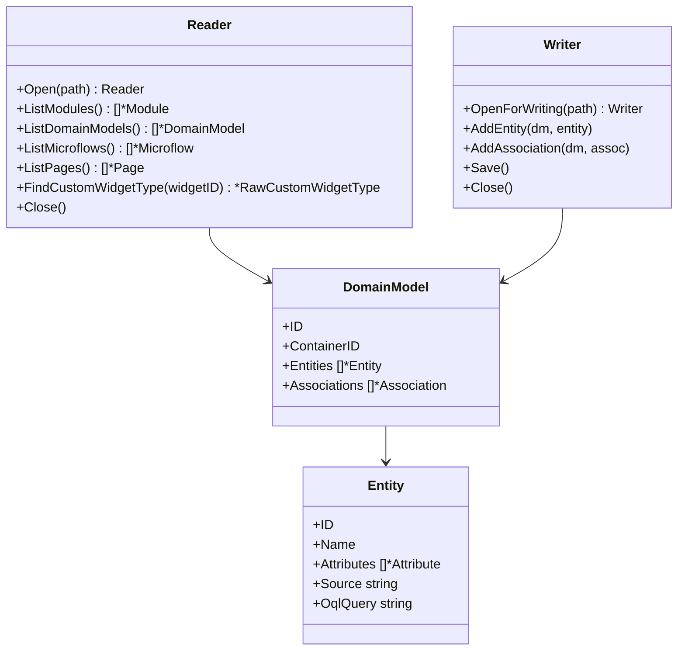

| Package | Purpose |
|---------|---------|
| `sdk/mpr/` | MPR file format handling (~18k lines across reader, writer, parser files split by domain) |
| `sdk/domainmodel` | Entity, Attribute, Association types |
| `sdk/microflows` | Microflow, Activity types (60+ types) |
| `sdk/pages` | Page, Widget types (50+ types) |
| `sdk/widgets` | Embedded widget templates for pluggable widgets (ComboBox, DataGrid2, Gallery, etc.) |

The `sdk/mpr/` package is split by domain for maintainability:

| File Pattern | Purpose |
|--------------|---------|
| `reader.go`, `reader_*.go` | Read-only MPR access, split by element type (documents, widgets, etc.) |
| `writer.go`, `writer_*.go` | Read-write MPR modification (domainmodel, microflow, security, widgets, etc.) |
| `parser.go`, `parser_*.go` | BSON parsing and deserialization (domainmodel, microflow, etc.) |
| `utils.go` | UUID generation utilities |

### 5. Model Layer (`model/`)

Core types shared across the SDK.

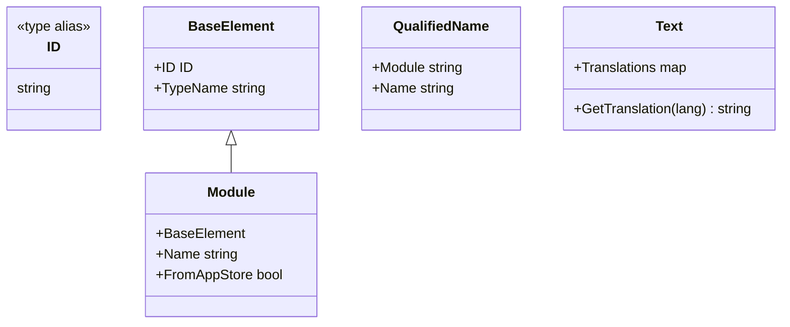

### 6. External SQL Layer (`sql/`)

The `sql/` package provides external database connectivity for querying PostgreSQL, Oracle, and SQL Server databases.

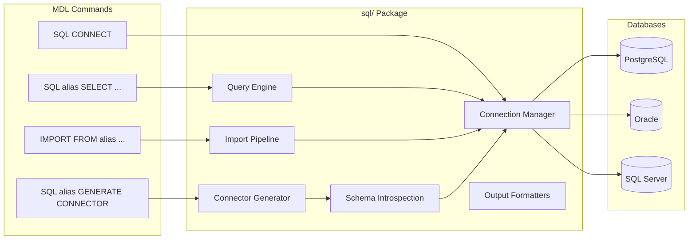

| File | Purpose |
|------|---------|
| `driver.go` | DriverName type, ParseDriver() |
| `connection.go` | Manager, Connection, credential isolation |
| `config.go` | DSN resolution (env vars, YAML config) |
| `query.go` | Execute() — query via database/sql |
| `meta.go` | ShowTables(), DescribeTable() via information_schema |
| `schema.go` | Schema discovery for connector generation |
| `import.go` | IMPORT pipeline: batch insert, ID generation, sequence tracking |
| `import_assoc.go` | Association import handling |
| `generate.go` | Database Connector MDL generation from external schema |
| `typemap.go` | SQL to Mendix type mapping, DSN to JDBC URL conversion |
| `mendix.go` | Mendix DB DSN builder, table/column name helpers |
| `naming.go` | Naming convention utilities |
| `format.go` | Table and JSON output formatters |

### 7. Internal Packages (`internal/`)

| Package | Purpose |
|---------|---------|
| `internal/codegen/schema` | JSON reflection data loading |
| `internal/codegen/transform` | Transform reflection data to Go types |
| `internal/codegen/emit` | Go source code generation and templates |

### 8. VS Code Extension (`vscode-mdl/`)

The VS Code extension provides MDL language support via an LSP client that communicates with `mxcli lsp --stdio`.

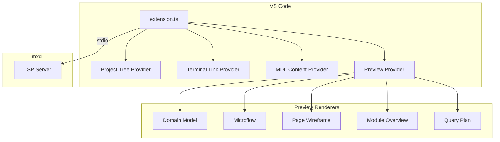

LSP features: syntax highlighting, parse/semantic diagnostics, completion, symbols, folding, hover, go-to-definition, clickable terminal links, and context menu commands.

### 9. LSP Server (`cmd/mxcli/lsp*.go`)

The LSP server is embedded in the `mxcli` binary and provides IDE integration.

| File | Purpose |
|------|---------|
| `lsp.go` | Main LSP server, hover, go-to-definition |
| `lsp_diagnostics.go` | Parse and semantic error reporting |
| `lsp_completion.go` | Context-aware completions |
| `lsp_completions_gen.go` | Generated completion data |
| `lsp_symbols.go` | Document symbols |
| `lsp_folding.go` | Code folding ranges |
| `lsp_hover.go` | Hover information |
| `lsp_helpers.go` | Shared utilities |

## MPR File Format

Mendix projects are stored in two formats:

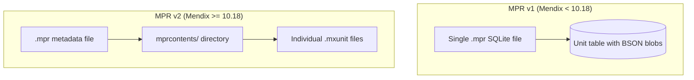

### Unit Document Structure

Each model element (entity, microflow, page, etc.) is stored as a BSON document:

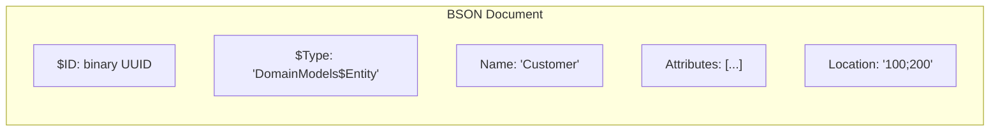

## Data Flow

### Reading a Project

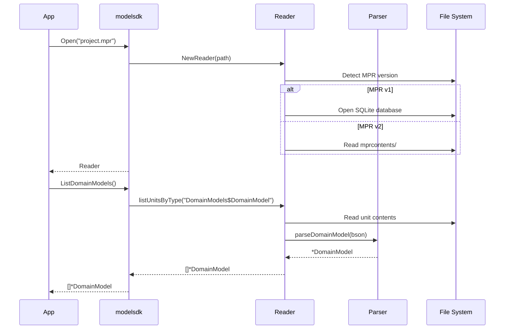

### Modifying a Project

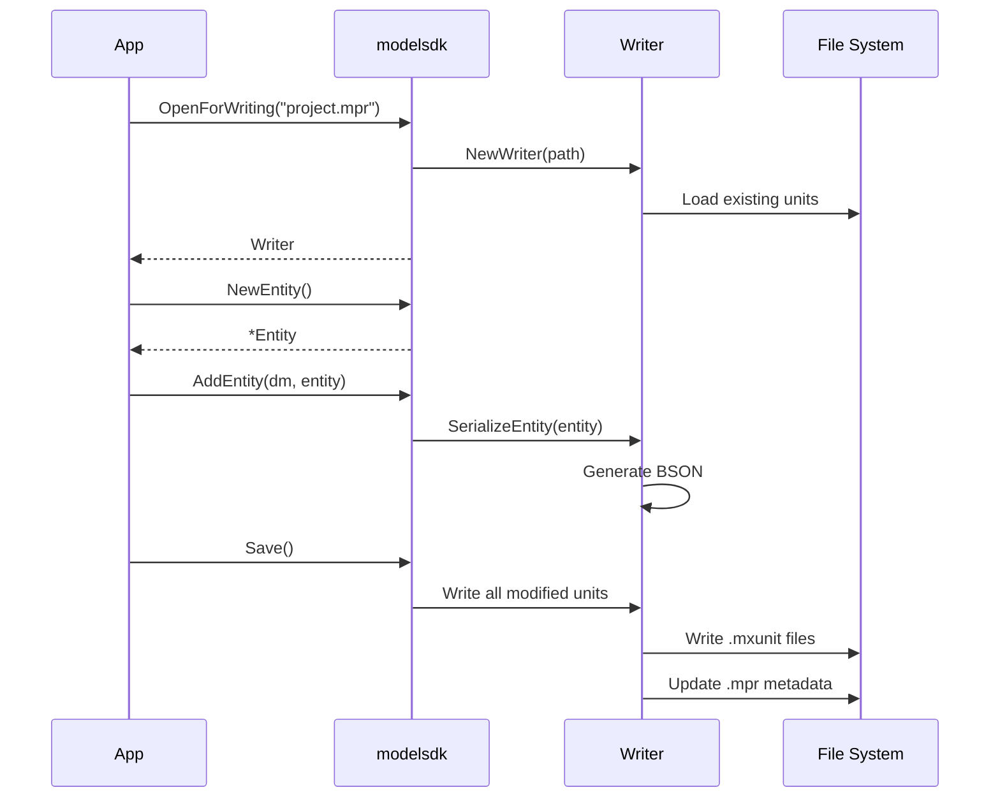

### External SQL Query Flow

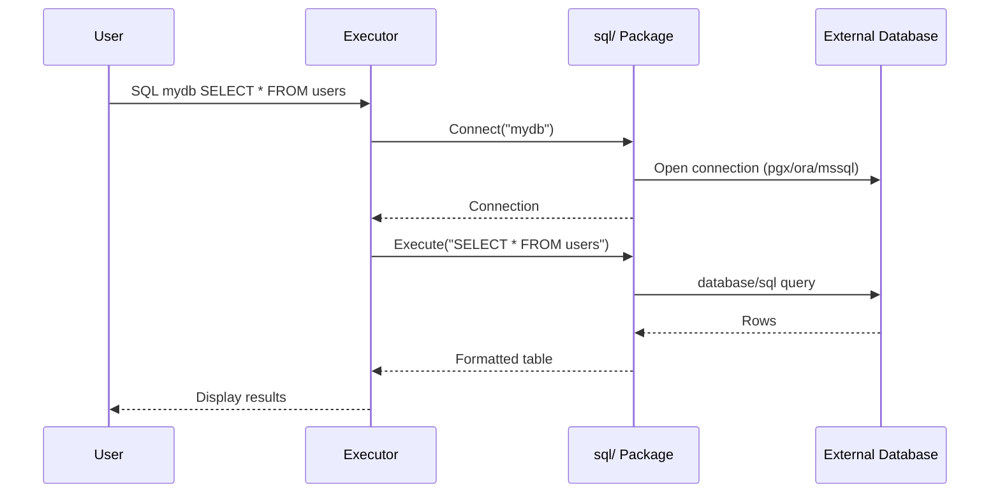

## MDL Command Processing

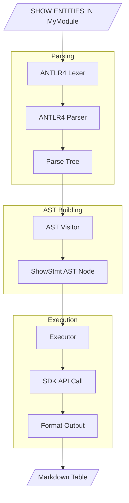

## Key Design Decisions

### 1. ANTLR4 for Grammar
- Cross-language grammar sharing (Go, TypeScript, Java)
- Case-insensitive keywords using fragment rules
- Listener pattern for building AST

### 2. BSON for Serialization
- Native Mendix format compatibility
- Uses `go.mongodb.org/mongo-driver/bson` package
- Handles polymorphic types via `$Type` field

### 3. Two-Phase Loading
- Units loaded on-demand for performance
- Lazy loading of related documents (e.g., OQL queries)

### 4. Interface-Based Design
- `Element` interface for polymorphic model elements
- `AttributeType` interface for different attribute types
- Enables type-safe operations across element types

### 5. Widget Template System

Pluggable widgets (React client) require complex BSON structures with internal ID references. Creating these from scratch is error-prone, so we use **embedded templates**:

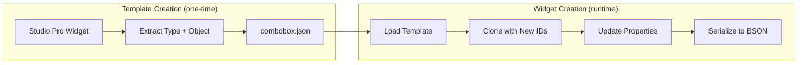

**Template structure:**
```
sdk/widgets/templates/mendix-11.6/
├── combobox.json       # ~5400 lines, ~88KB BSON
├── datagrid.json
└── ...
```

**Each template contains:**
- `type`: Full `CustomWidgetType` with all `PropertyTypes` (~54 KB)
- `object`: Full `WidgetObject` with all property values (~34 KB)

**Cloning process:**
1. Generate new UUIDs for all `$ID` fields
2. Build old-ID → new-ID mapping
3. Update all `TypePointer` references to use new IDs
4. Modify specific property values (e.g., attribute binding)

**Key implementation details:**
- TypePointer references must remain consistent between Type and Object
- Nested WidgetObjects (e.g., DataGrid2 columns) require ALL properties to be created
- Expression-type properties require non-empty values (template may have placeholders)
- See [PAGE_BSON_SERIALIZATION.md](../03-development/PAGE_BSON_SERIALIZATION.md) for detailed serialization rules

### 6. Pluggable Widget Engine

The **PluggableWidgetEngine** is a data-driven system that replaces hardcoded widget builders with a registry of `.def.json` widget definition files. It handles CREATE, INSERT, and ALTER operations for all pluggable (React client-side) widgets.

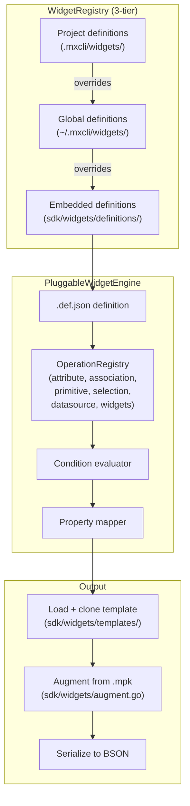

**Widget definition format (`.def.json`):**
Each file describes a single widget type — its MDL property mappings, conditions, and operation types:
```json
{
  "widgetId": "com.mendix.widget.web.combobox.ComboBox",
  "properties": [
    { "key": "attribute",  "op": "attribute",  "mdl": "ATTRIBUTE" },
    { "key": "datasource", "op": "datasource", "mdl": "DATA_SOURCE" }
  ]
}
```

**WidgetRegistry — 3-tier loading:**
1. Embedded definitions (compiled into the binary via `go:embed`)
2. Global user definitions (`~/.mxcli/widgets/`) — override embedded
3. Project-level definitions (`.mxcli/widgets/`) — override global

This allows users to add support for custom or third-party widgets without recompiling mxcli.

**OperationRegistry — 6 built-in operation types:**

| Operation | Description |
|-----------|-------------|
| `attribute` | Bind an entity attribute |
| `association` | Bind an entity association |
| `primitive` | Set a primitive value (string, bool, int) |
| `selection` | Set a selection enum value |
| `datasource` | Configure a data source (Database, Microflow, Nanoflow) |
| `widgets` | Nest child widgets in a container slot |

**`mxcli widget extract` CLI command:**
Generates a skeleton `.def.json` from a `.mpk` widget package file, making it easy to add support for new third-party widgets:
```bash
mxcli widget extract --mpk path/to/widget.mpk --output .mxcli/widgets/
```

**Augmentation pipeline (CE0463 prevention):**
When a widget is written to an MPR, `AugmentTemplate` reconciles the embedded template against the project's installed `.mpk` version — adding missing properties and removing stale ones, including **nested ObjectType properties** (e.g., DataGrid2 column sub-properties). This prevents the CE0463 "widget definition changed" error when the project's widget version differs from the embedded template.

Key files: `mdl/executor/widget_engine.go` (engine), `mdl/executor/widget_registry.go` (registry), `sdk/widgets/augment.go` (augmentation), `sdk/widgets/mpk/mpk.go` (`.mpk` parser).

### 7. Catalog System


The SQLite-based catalog (`mdl/catalog/`) enables cross-reference queries and code search:

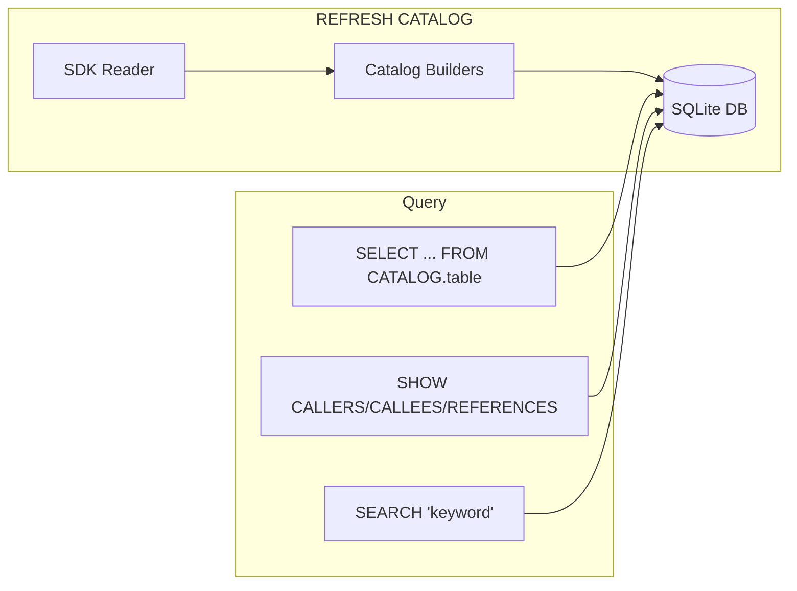

Builders populate tables for modules, entities, microflows, pages, permissions, references, and source code.

### 8. Credential Isolation for External SQL

External database credentials are managed through environment variables or YAML config, never stored in MDL scripts:

```
DSN resolution order:
1. Environment variable: MXCLI_SQL_{ALIAS}_DSN
2. YAML config: ~/.mxcli/sql.yaml
3. Inline connection string (development only)
```

### 9. Pure Go / No CGO

The project uses `modernc.org/sqlite` (a pure Go SQLite implementation) to eliminate the CGO dependency. This simplifies cross-compilation and deployment — no C compiler is required.

### 10. Multi-Version Support

Mendix projects vary along three versioning axes: **platform version** (9.x–11.x), **widget version** (each project bundles specific `.mpk` widget packages), and **extension documents** (Mendix 11+ custom document types). The BSON document structure changes across all three.

**Current state**: Hand-coded parsers/writers target ~Mendix 11.6. Widget templates are static JSON files extracted from a single Mendix version.

**Widget augmentation (implemented)**: At runtime, mxcli reads the project's `.mpk` widget packages and augments the static template — adding missing properties and removing stale ones — before BSON conversion. This ensures the serialized widget matches the exact version installed in the project.

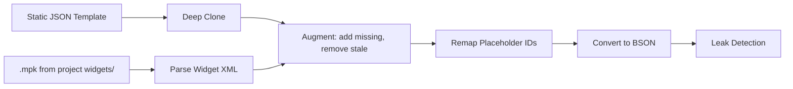

Key files: `sdk/widgets/augment.go` (augmentation logic), `sdk/widgets/mpk/mpk.go` (`.mpk` parser), `sdk/widgets/loader.go` (pipeline integration).

**Planned: Schema Registry** (`sdk/schema/`): A runtime registry loaded from reflection data that provides type metadata (storage names, defaults, reference kinds, list encodings) per Mendix version. This will complement the hand-coded parsers/writers by handling field completeness, validation, and version migration. See [Multi-Version Support](../11-proposals/MULTI_VERSION_SUPPORT.md) for the full architecture and implementation status.

### 11. Backend Abstraction + Dependency Inversion

The executor **never imports `sdk/mpr`**. All project access goes through `ctx.Backend`, which implements `backend.FullBackend`. This enables:
- Unit tests without a `.mpr` file (inject `MockBackend`)
- Alternative storage backends (cloud, in-memory, etc.)
- Isolated BSON mutation logic in `mdl/backend/mpr/`

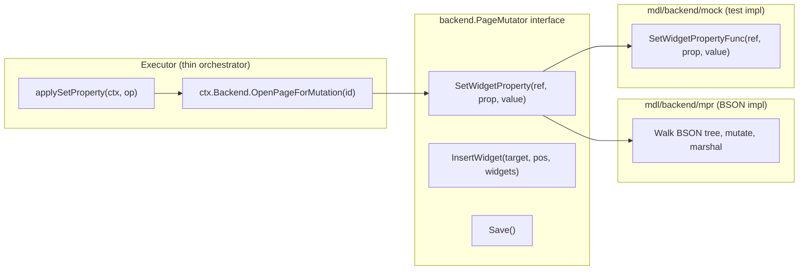

**Rule for new executor commands:**
1. Add a method to the appropriate domain interface in `mdl/backend/` (e.g., `DomainModelBackend`, `MicroflowBackend`)
2. Implement it in `mdl/backend/mpr/` operating on BSON/reader/writer
3. Add a `Func`-field stub in `mdl/backend/mock/`
4. Call `ctx.Backend.YourMethod()` from the executor handler
5. Never call `sdk/mpr` types directly from the executor

**Mutation pattern (ALTER PAGE / ALTER WORKFLOW):**

For operations that modify a document in place, use the `PageMutator`/`WorkflowMutator` factory pattern:
1. `mutator, err := ctx.Backend.OpenPageForMutation(unitID)` — opens the document
2. Call mutator methods (`SetWidgetProperty`, `InsertWidget`, etc.)
3. `mutator.Save()` — persists the changes

The mutator owns the document's lifecycle; the executor only describes *what* to change.

**Shared types (`mdl/types/`):**

Types used by both `mdl/` and `sdk/mpr` live in `mdl/types/`. The `sdk/mpr` package re-exports them as type aliases (`type JavaAction = types.JavaAction`) for backward compatibility. New shared types go in `mdl/types/`, not in `sdk/mpr/reader_types.go`.

## Future Architecture Considerations

1. **48 of 52 Metamodel Domains**: Workflows, REST services, and many other domains are not yet implemented
2. **Delta/Change Tracking**: Track modifications for efficient saves
3. **Caching Layer**: Cache parsed units for repeated access
4. **Parallel Loading**: Load independent units concurrently
5. **Runtime Type Reflection**: Dynamic type introspection
6. **Schema Registry**: Version-aware BSON serialization and validation (see [Multi-Version Support](../11-proposals/MULTI_VERSION_SUPPORT.md))
