# Mendix for Agentic IDEs: Vision & Architecture

> **Status**: Vision Document (Updated February 2026)
> **Audience**: Product Strategy, Architecture, Engineering Leadership

## Executive Summary

The rise of AI-powered coding assistants (Claude Code, GitHub Copilot, Cursor, Windsurf) is transforming software development. These "agentic IDEs" can generate, modify, and debug code autonomously. However, they face significant challenges when generating enterprise business applications:

1. **Verbosity**: General-purpose languages require extensive boilerplate
2. **Risk**: AI-generated code may contain security vulnerabilities, bugs, or architectural flaws
3. **Review burden**: Users struggle to validate large volumes of generated code
4. **Governance**: Enterprises need guardrails around AI-generated software

**Mendix is uniquely positioned to address these challenges** through:

- **MDL (Mendix Definition Language)**: A concise DSL that is 5-10x more token-efficient than equivalent TypeScript/Java
- **Platform Guarantees**: Built-in security, scalability, and compliance from the Mendix runtime
- **Model Validation**: Comprehensive checks that catch errors before deployment
- **Visual Review**: Generated applications can be reviewed in Studio Pro's visual interface

### Strategic Differentiators

| Differentiator | Value Proposition |
|----------------|-------------------|
| **Open Platform** | First low-code platform with full AI agent integration—no proprietary lock-in |
| **Bring Your Own Agent** | Works with Claude Code, Copilot, Cursor, or any future AI agent |
| **Human + AI Collaboration** | Built for true collaboration—agents generate, humans review and refine |
| **Hours, Not Weeks** | Complex use cases (migration, bulk updates, monolith decomposition) achievable in hours |
| **Co-existence Strategy** | Best of both worlds—visual Studio Pro for design, CLI/agents for automation |

This document outlines how Mendix can become the preferred target for agentic code generation of business applications.

### Current Implementation Highlights

The following components have been implemented:

- **mxcli**: Unified CLI with `exec`, `check`, `lint`, `diff`, `search`, `init` commands
- **ANTLR4 Parser**: Cross-language grammar for MDL syntax
- **CATALOG System**: SQL-based metadata queries with REFS table and code search commands
- **Linting Framework**: Extensible rules with SARIF output for CI/CD
- **Claude Code Integration**: `mxcli init` installs skills and commands into Mendix projects
- **Semantic Validation**: Variable scope checking, return value requirements, reference validation

---

## The Opportunity

### Market Context: Agentic IDEs

A new category of development tools is emerging:

| Tool | Description | Capability |
|------|-------------|------------|
| **Claude Code** | Anthropic's CLI agent | Full codebase understanding, multi-file edits, terminal access |
| **GitHub Copilot Workspace** | GitHub's agentic coding | Issue-to-PR automation, code generation |
| **Cursor** | AI-native IDE | Inline generation, codebase chat, multi-file edits |
| **Windsurf** | Codeium's agentic IDE | Autonomous coding flows, context awareness |
| **Devin** | Cognition's AI developer | Fully autonomous software engineering |

These tools are rapidly improving and will soon be capable of generating entire applications from natural language specifications.

### The Problem: AI + Traditional Code = Risk

When agentic IDEs generate traditional code (TypeScript, Python, Java), enterprises face:


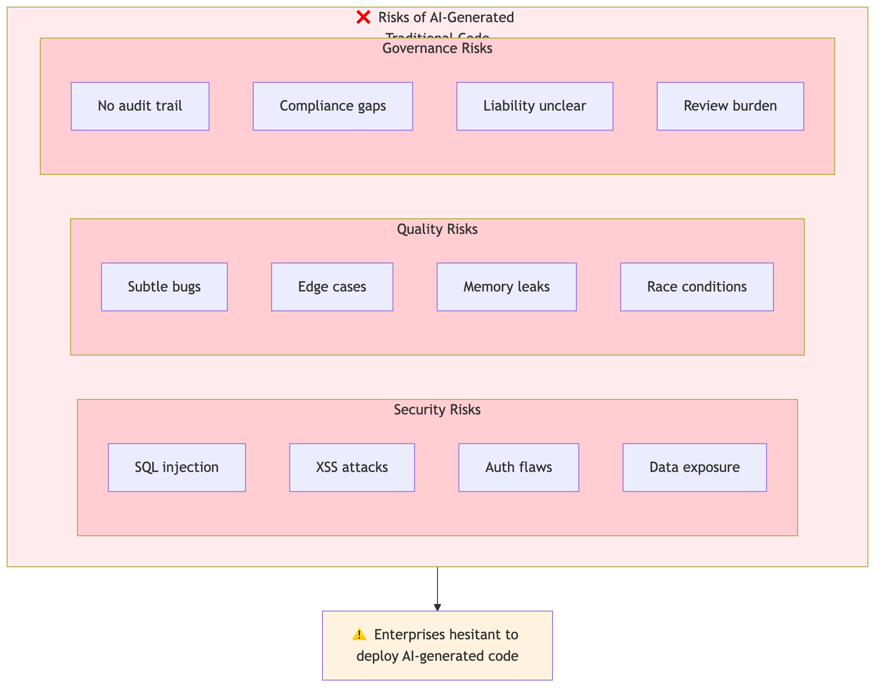


### The Mendix Advantage

Mendix transforms this equation:


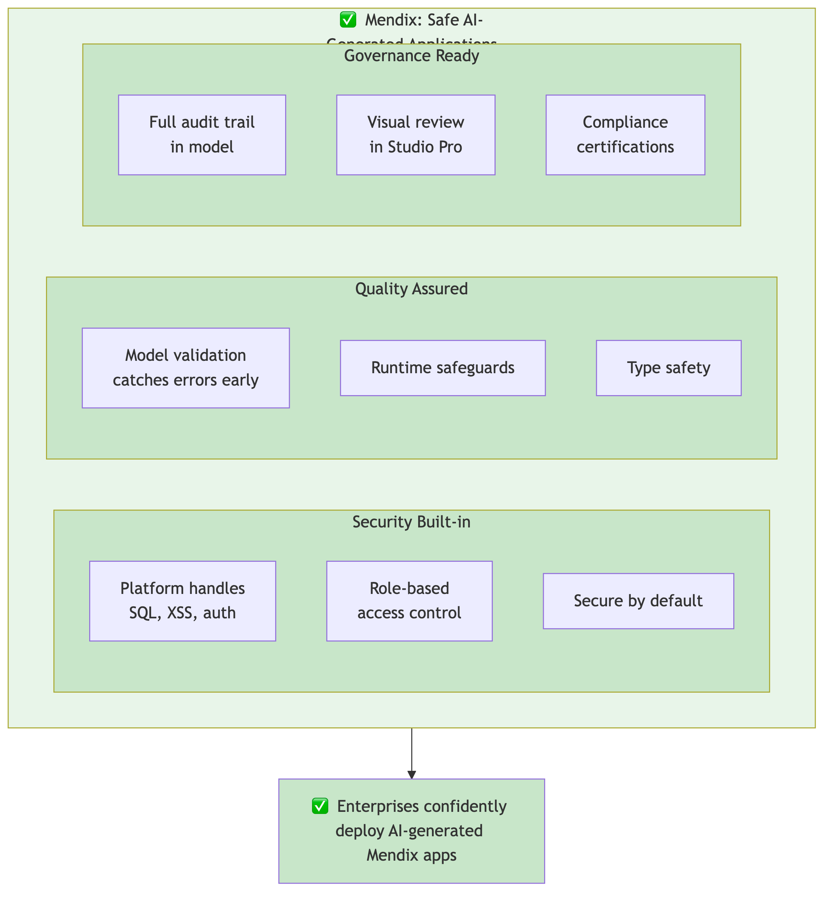


---

## MDL: A Token-Efficient DSL for Business Applications

### What is MDL?

MDL (Mendix Definition Language) is a textual representation of Mendix models. It provides:

- **Declarative syntax** for entities, microflows, pages, integrations
- **SQL-like familiarity** for developers and AI models
- **Bidirectional mapping** to/from Mendix visual models

### Token Efficiency: MDL vs Traditional Code

AI models are constrained by context windows and cost per token. MDL is dramatically more efficient:

**Example: Create a Customer entity with CRUD operations**

#### Traditional TypeScript (Prisma + Next.js): ~450 tokens

```typescript
// schema.prisma
model Customer {
  id        Int      @id @default(autoincrement())
  name      String   @db.VarChar(200)
  email     String   @db.VarChar(200)
  balance   Decimal  @default(0)
  isActive  Boolean  @default(true)
  createdAt DateTime @default(now())
  updatedAt DateTime @updatedAt
}

// pages/api/customers/index.ts
import { PrismaClient } from '@prisma/client'
const prisma = new PrismaClient()

export default async function handler(req, res) {
  if (req.method === 'GET') {
    const customers = await prisma.customer.findMany()
    return res.json(customers)
  }
  if (req.method === 'POST') {
    const customer = await prisma.customer.create({
      data: req.body
    })
    return res.json(customer)
  }
}

// pages/api/customers/[id].ts
export default async function handler(req, res) {
  const { id } = req.query
  if (req.method === 'GET') {
    const customer = await prisma.customer.findUnique({
      where: { id: Number(id) }
    })
    return res.json(customer)
  }
  if (req.method === 'PUT') {
    const customer = await prisma.customer.update({
      where: { id: Number(id) },
      data: req.body
    })
    return res.json(customer)
  }
  if (req.method === 'DELETE') {
    await prisma.customer.delete({
      where: { id: Number(id) }
    })
    return res.status(204).end()
  }
}

// Plus: validation, error handling, authentication, authorization...
```

#### MDL: ~80 tokens (5-6x more efficient)

```sql
CREATE PERSISTENT ENTITY CRM.Customer (
  Name: String(200) NOT NULL,
  Email: String(200),
  Balance: Decimal DEFAULT 0,
  IsActive: Boolean DEFAULT true
);

-- CRUD operations are automatic in Mendix!
-- Security, validation, API all handled by platform
```

### Why Token Efficiency Matters

| Factor | Impact |
|--------|--------|
| **Cost** | Fewer tokens = lower API costs for AI generation |
| **Speed** | Smaller context = faster generation |
| **Accuracy** | Less code = fewer opportunities for errors |
| **Review** | Concise output = easier human validation |
| **Context** | More room for specifications and examples |

### MDL Coverage

MDL aims to express complete business applications. The table below reflects the current implementation status:

| Domain | MDL Constructs | Status |
|--------|----------------|--------|
| **Data Model** | Entity, Association, Enumeration, Index | ✅ Implemented |
| **Business Logic** | Microflow (core activities), Nanoflow, Rules | ⚠️ Partial — microflows have core activities but many activity types missing; nanoflows and rules not yet implemented |
| **User Interface** | Page, Snippet, Layout, Widgets (V3 syntax) | ⚠️ Partial — basic page/widget support; many widgets and widget options missing |
| **Integration** | REST Client, Database Connection, OData, Business Events | 🔄 Syntax designed — REST has initial syntax; OData (external entities/actions), business events, and database connector lack implementation |
| **Security** | Module Roles, Entity Access, Project Security | 📋 Planned — no implementation or detailed design yet |
| **Configuration** | Constants, Scheduled Events, Project Settings, Module Settings | 📋 Planned — not yet implemented |
| **Code Analysis** | Linting, Impact Analysis, Cross-references, Search | 🔄 In progress — linting and catalog refs working; coverage expanding |
| **Workflows** | Workflow definitions, User Tasks, Decisions | 📋 Planned — not yet implemented |
| **Mobile** | Native pages, Navigation profiles, Offline sync | 📋 Planned — not yet implemented |
| **Styling** | Atlas theme customization, Design properties | 📋 Planned — not yet implemented |
| **Data Importer** | Import templates, Data mapping | 📋 Planned — not yet implemented |
| **Mappings** | Import/Export mappings, JSON snippets, XML schemas | 📋 Planned — not yet implemented |
| **Advanced** | JavaScript actions, Task queues, Regular expressions | 📋 Planned — not yet implemented |

### Why Declarative DSL? Comparing Approaches

When enabling AI agents to manipulate Mendix models, several approaches are possible. Here's why a declarative DSL (MDL) is the optimal choice:

| Aspect | Direct JSON | TypeScript API | Declarative DSL | Graph (SPARQL) |
|--------|-------------|----------------|-----------------|----------------|
| **LLM token efficiency** | ❌ 20K+ lines | ⚠️ Verbose | ✅ Compact | ✅ Query-focused |
| **LLM accuracy** | ❌ Poor at JSON editing | ✅ Well-trained on TS | ✅ Simple syntax | ❌ SPARQL errors |
| **Paradigm match** | ⚠️ Data only | ❌ Procedural for declarative domain | ✅ Declarative ↔ declarative | ✅ Graphs match relations |
| **Two-language problem** | ❌ JSON + mental model | ❌ TS + Mendix interleaved | ✅ Single language | ⚠️ Query + update separate |
| **Human review** | ❌ Unreadable | ⚠️ Must trace execution | ✅ Diff is scannable | ❌ Queries not reviewable |
| **Skill authoring** | ❌ Impractical | ⚠️ Verbose boilerplate | ✅ Readable patterns | ⚠️ SHACL is complex |
| **Modification precision** | ❌ Error-prone | ✅ Atomic operations | ✅ Structural identity | ⚠️ SPARQL UPDATE complex |

**Key insight**: Mendix microflows are already declarative. Using a procedural API to describe declarative structures creates a paradigm mismatch. MDL's declarative syntax matches the declarative nature of Mendix models.

### CLI Tools vs MCP Service

A Mendix project is more than just the model—it includes Java actions, JavaScript widgets, SCSS styling, and more:

```
my-app/
├── model/*.json           ← Model (MDL/mxcli domain)
├── javasource/            ← Java actions (file editing)
├── javascriptsource/      ← Custom widgets (file editing)
├── themesource/           ← SCSS styling (file editing)
└── widgets/               ← Widget packages
```

| Aspect | Studio Pro MCP | CLI Tools (mxcli + file ops) |
|--------|----------------|------------------------------|
| **Model access** | ✅ Full model API | ✅ Via MDL parsing |
| **Filesystem access** | ❌ Out of scope | ✅ Native file operations |
| **Java/JS editing** | ❌ Outside model | ✅ Standard file editing |
| **Atomic commits** | ⚠️ Model only | ✅ Git for everything |
| **Offline operation** | ❌ Requires Studio Pro | ✅ Works standalone |
| **CI/CD integration** | ⚠️ Complex | ✅ Natural fit |
| **Agent autonomy** | ⚠️ Bound to Studio Pro | ✅ Full control |

**Recommendation**: CLI-based approach (mxcli) has a fundamental advantage—a Mendix project is a directory with files. An agent building a complete feature (entity + microflow + Java action + page + styling) works more effectively via CLI tools that treat the entire project as a filesystem.

### Hybrid Architecture: Model + Files


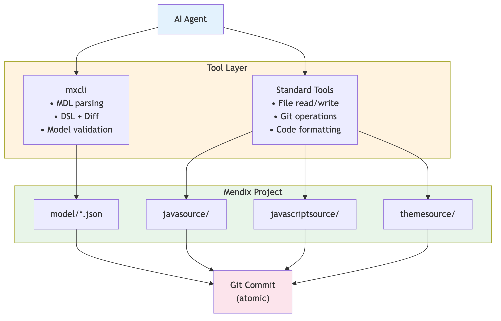


---

## Architecture: Enabling Agentic IDEs

### System Overview


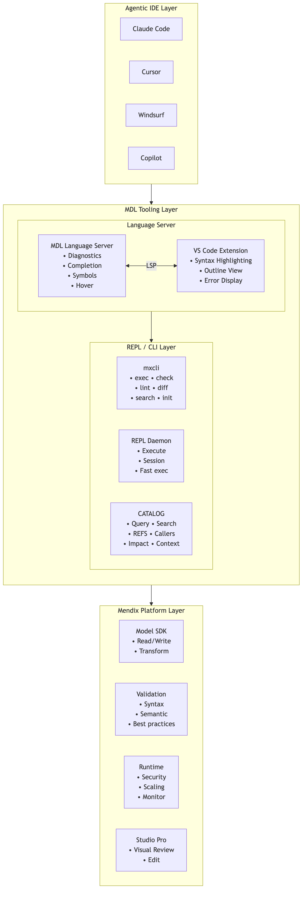


### Capabilities Required by Agentic IDEs

AI coding agents need specific capabilities to work effectively. Here's how MDL tooling provides them:

#### 1. Code Generation & Modification

| Capability | Traditional | MDL Approach |
|------------|-------------|--------------|
| **Create files** | Write to filesystem | `CREATE ENTITY`, `CREATE MICROFLOW` |
| **Modify code** | Text-based edits | `ALTER ENTITY`, `CREATE OR MODIFY` |
| **Delete code** | File deletion | `DROP ENTITY`, `DROP MICROFLOW` |
| **Refactor** | AST manipulation | Declarative re-generation |

**MDL Advantage**: Atomic operations with clear semantics. AI doesn't need to understand file structure.

#### 2. Code Understanding & Search

| Capability | Traditional | MDL Approach |
|------------|-------------|--------------|
| **Search code** | grep, ripgrep | `SEARCH 'keyword'` or `SELECT * FROM CATALOG.ENTITIES WHERE ...` |
| **Find usages** | LSP references | `SHOW REFERENCES TO Module.Entity` |
| **Find callers** | Manual tracing | `SHOW CALLERS OF Module.Microflow [TRANSITIVE]` |
| **Impact analysis** | Manual review | `SHOW IMPACT OF Module.Entity` |
| **Understand structure** | Parse AST | `DESCRIBE ENTITY`, `DESCRIBE MICROFLOW` |
| **Navigate relationships** | Go to definition | `SHOW CALLEES OF`, CATALOG JOINs |
| **Assemble context** | Manual gathering | `SHOW CONTEXT OF Module.Microflow DEPTH 3` |

**MDL Advantage**: High-level code search commands and SQL-like queries for semantic search. No regex pattern matching on source code.

```sql
-- Full-text search across strings and source
SEARCH 'validation'

-- Find what calls a microflow (direct and transitive)
SHOW CALLERS OF CRM.ACT_Customer_Save TRANSITIVE

-- Find what a microflow calls
SHOW CALLEES OF CRM.ProcessOrder

-- Find all references to an entity
SHOW REFERENCES TO CRM.Customer

-- Analyze impact of changing an element
SHOW IMPACT OF CRM.Customer

-- Assemble context for LLM consumption
SHOW CONTEXT OF CRM.ACT_Customer_Save DEPTH 3

-- SQL-based queries via CATALOG
SELECT SourceName, RefKind, TargetName
FROM CATALOG.REFS
WHERE TargetName = 'CRM.Customer';
```

#### 3. Validation & Testing

| Capability | Traditional | MDL Approach |
|------------|-------------|--------------|
| **Syntax check** | Compiler/linter | MDL parser + Language Server |
| **Type check** | TypeScript/mypy | Model validation |
| **Integration test** | Jest/pytest | Mendix test suite |
| **Security scan** | SAST tools | Platform security model |

**MDL Advantage**: Multi-level validation catches errors early.


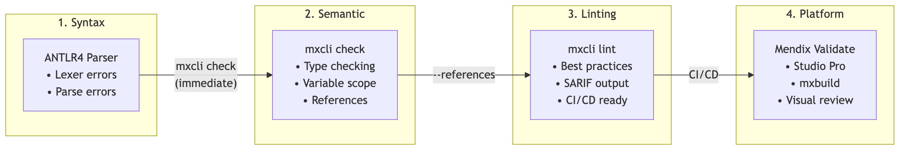


#### 4. Execution & Feedback

| Capability | Traditional | MDL Approach |
|------------|-------------|--------------|
| **Run code** | Node/Python process | REPL daemon execution |
| **Get errors** | Stack traces | Structured error messages |
| **Hot reload** | Dev server | Model sync |
| **Debug** | Debugger protocol | Microflow debugging |

**MDL Advantage**: Immediate execution with structured feedback.

```bash
# AI validates MDL syntax before execution
$ mxcli check script.mdl
✓ Syntax OK

# AI validates with reference checking
$ mxcli check script.mdl -p app.mpr --references
Error: Entity 'CRM.InvalidEntity' not found

# AI executes MDL against project
$ mxcli exec script.mdl -p app.mpr
Created entity: CRM.Lead
Created microflow: CRM.ACT_Lead_Save

# AI runs linting for best practices
$ mxcli lint -p app.mpr --format sarif
{
  "runs": [{ "results": [...] }]
}

# AI can self-correct and retry based on feedback
```

---

## Skills & Prompting: Guiding AI Generation

### The Challenge: AI Needs Context

AI models are powerful but generic. Without domain-specific guidance, they may:
- Generate syntactically valid but semantically incorrect MDL
- Miss Mendix best practices and conventions
- Create inefficient or non-idiomatic solutions
- Overlook security or validation requirements

**Skills** (structured prompt templates) bridge this gap by providing:
- Domain knowledge about Mendix patterns
- MDL syntax examples and conventions
- Best practices for specific scenarios
- Validation rules and constraints

### Skill Architecture


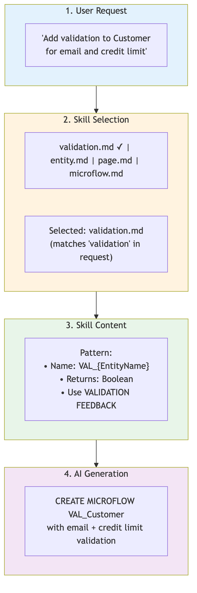


**Example: Skill-guided validation microflow generation**

The AI receives the skill content which provides:
- Naming convention: `VAL_{EntityName}`
- Required parameter: the entity to validate
- Pattern: use `VALIDATION FEEDBACK` for errors, return `Boolean`

The AI then generates a complete validation microflow following the pattern:

```sql
CREATE MICROFLOW CRM.VAL_Customer ($Customer: CRM.Customer)
RETURNS Boolean
BEGIN
  -- Email validation
  IF $Customer/Email = empty THEN
    VALIDATION FEEDBACK $Customer MEMBER Email MESSAGE 'Email is required';
    RETURN false;
  END IF;

  IF NOT contains($Customer/Email, '@') THEN
    VALIDATION FEEDBACK $Customer MEMBER Email MESSAGE 'Invalid email format';
    RETURN false;
  END IF;

  -- Credit limit validation
  IF $Customer/CreditLimit < 0 THEN
    VALIDATION FEEDBACK $Customer MEMBER CreditLimit MESSAGE 'Cannot be negative';
    RETURN false;
  END IF;

  RETURN true;
END;
```

### Skill Categories

| Category | Purpose | Skill File |
|----------|---------|------------|
| **Domain Model** | Entity/association patterns | `generate-domain-model.md` |
| **Microflow** | Business logic patterns | `write-microflows.md` |
| **Pages** | UI patterns (V3 syntax) | `create-page.md`, `overview-pages.md`, `master-detail-pages.md` |
| **Validation** | Pre-flight checks | `check-syntax.md` |
| **Debugging** | BSON/serialization issues | `debug-bson.md` |

These skills are installed via `mxcli init` into the `.claude/skills/` folder of a Mendix project.

### Example Skills

#### Validation Microflow Skill

```markdown
# Validation Microflow Generation

## When to Use
Generate validation microflows when the user requests:
- Input validation for entities
- Business rule enforcement
- Data quality checks

## Naming Convention
- Microflow name: `VAL_{EntityName}` or `Validate{EntityName}`
- Place in same module as entity

## MDL Pattern

CREATE MICROFLOW {Module}.VAL_{EntityName} (
  ${EntityName}: {Module}.{EntityName}
)
RETURNS Boolean
BEGIN
  -- Required field validation
  IF ${EntityName}/{RequiredField} = empty THEN
    VALIDATION FEEDBACK ${EntityName} MEMBER {RequiredField}
      MESSAGE '{FieldLabel} is required';
    RETURN false;
  END IF;

  -- Format validation (email, phone, etc.)
  IF NOT {formatCheck} THEN
    VALIDATION FEEDBACK ${EntityName} MEMBER {Field}
      MESSAGE '{ValidationMessage}';
    RETURN false;
  END IF;

  -- Range validation
  IF ${EntityName}/{NumericField} < {Min} OR ${EntityName}/{NumericField} > {Max} THEN
    VALIDATION FEEDBACK ${EntityName} MEMBER {NumericField}
      MESSAGE '{FieldLabel} must be between {Min} and {Max}';
    RETURN false;
  END IF;

  RETURN true;
END;

## Common Validations

| Type | MDL Expression |
|------|----------------|
| Required | `$Entity/Field = empty` |
| Email format | `NOT contains($Entity/Email, '@')` |
| Min length | `length($Entity/Field) < {min}` |
| Max length | `length($Entity/Field) > {max}` |
| Positive number | `$Entity/Amount <= 0` |
| Date in future | `$Entity/Date < [%CurrentDateTime%]` |
| Regex match | `NOT matches($Entity/Field, '{pattern}')` |

## Example: Complete Customer Validation

CREATE MICROFLOW CRM.VAL_Customer ($Customer: CRM.Customer)
RETURNS Boolean
BEGIN
  -- Name is required
  IF $Customer/Name = empty THEN
    VALIDATION FEEDBACK $Customer MEMBER Name
      MESSAGE 'Customer name is required';
    RETURN false;
  END IF;

  -- Email format
  IF $Customer/Email != empty AND NOT contains($Customer/Email, '@') THEN
    VALIDATION FEEDBACK $Customer MEMBER Email
      MESSAGE 'Please enter a valid email address';
    RETURN false;
  END IF;

  -- Credit limit range
  IF $Customer/CreditLimit < 0 THEN
    VALIDATION FEEDBACK $Customer MEMBER CreditLimit
      MESSAGE 'Credit limit cannot be negative';
    RETURN false;
  END IF;

  IF $Customer/CreditLimit > 1000000 THEN
    VALIDATION FEEDBACK $Customer MEMBER CreditLimit
      MESSAGE 'Credit limit cannot exceed 1,000,000';
    RETURN false;
  END IF;

  RETURN true;
END;
```

#### Overview Page Skill

```markdown
# Overview Page Generation

## When to Use
Generate overview pages for:
- Entity list views
- Master-detail layouts
- Searchable data grids

## Naming Convention
- Page name: `{EntityName}_Overview`
- Place in same module as entity

## MDL Pattern

```sql
CREATE PAGE {Module}.{EntityName}_Overview
(
  Title: '{Entity Display Name} Overview',
  Layout: Atlas_Core.Atlas_Default
)
{
  LAYOUTGRID gridMain {
    ROW row1 {
      COLUMN col1 (Weight: 12) {
        CONTAINER containerHeader {
          DYNAMICTEXT txtTitle (Content: '{Entity Display Name}', RenderMode: H1)
          ACTIONBUTTON btnNew (
            Caption: 'New {EntityName}',
            Action: CREATE_OBJECT {Module}.{EntityName},
            OnClickPage: {Module}.{EntityName}_NewEdit,
            Style: Primary
          )
        }
      }
      COLUMN col2 (Weight: 12) {
        DATAGRID grid{EntityName} (DataSource: DATABASE {Module}.{EntityName}) {
          COLUMN col{Attr} (AttributePath: {AttributeName}, Caption: '{Display Label}')
          -- ... more columns
          CONTROLBAR ctrlBar {
            SEARCH search1
            PAGING paging1
          }
        }
      }
    }
  }
}
```

## Example: Customer Overview

```sql
CREATE PAGE CRM.Customer_Overview
(
  Title: 'Customer Overview',
  Layout: Atlas_Core.Atlas_Default
)
{
  LAYOUTGRID gridMain {
    ROW row1 {
      COLUMN colHeader (Weight: 12) {
        CONTAINER containerHeader {
          DYNAMICTEXT txtTitle (Content: 'Customers', RenderMode: H1)
          ACTIONBUTTON btnNew (
            Caption: 'New Customer',
            Action: CREATE_OBJECT CRM.Customer,
            OnClickPage: CRM.Customer_NewEdit,
            Style: Primary
          )
        }
      }
      COLUMN colGrid (Weight: 12) {
        DATAGRID gridCustomer (DataSource: DATABASE CRM.Customer) {
          COLUMN colName (AttributePath: Name, Caption: 'Customer Name')
          COLUMN colEmail (AttributePath: Email, Caption: 'Email Address')
          COLUMN colCredit (AttributePath: CreditLimit, Caption: 'Credit Limit')
          COLUMN colActive (AttributePath: IsActive, Caption: 'Active')
          CONTROLBAR ctrlBar {
            SEARCH search1
            PAGING paging1
          }
        }
      }
    }
  }
}
```

#### CRUD Microflow Skill

```markdown
# CRUD Microflow Generation

## Save Microflow Pattern

CREATE MICROFLOW {Module}.ACT_{EntityName}_Save (
  ${EntityName}: {Module}.{EntityName}
)
RETURNS Boolean
BEGIN
  -- Validate
  $IsValid = CALL {Module}.VAL_{EntityName} ($Object = ${EntityName});

  IF NOT $IsValid THEN
    RETURN false;
  END IF;

  -- Save
  COMMIT ${EntityName};

  -- Provide feedback
  LOG MESSAGE 'INFO' '{EntityName} saved successfully';

  RETURN true;
END;

## Delete Microflow Pattern

CREATE MICROFLOW {Module}.ACT_{EntityName}_Delete (
  ${EntityName}: {Module}.{EntityName}
)
BEGIN
  -- Confirm deletion (handled by calling page)

  -- Check for dependencies
  RETRIEVE $RelatedObjects FROM DATABASE
    WHERE {RelatedEntity}/{Association} = ${EntityName};

  IF $RelatedObjects != empty THEN
    LOG MESSAGE 'WARNING' 'Cannot delete: related records exist';
    RETURN;
  END IF;

  -- Delete
  DELETE ${EntityName};

  -- Feedback
  LOG MESSAGE 'INFO' '{EntityName} deleted successfully';

  CLOSE PAGE;
END;
```

### Skills in Practice: End-to-End Example

**User Request**: "Create a complete customer management module with validation"

**AI Response (using multiple skills)**:

```sql
-- 1. Entity (using entity skill)
CREATE PERSISTENT ENTITY CustomerMgmt.Customer (
  Code: String(20) NOT NULL UNIQUE,
  Name: String(200) NOT NULL,
  Email: String(200),
  Phone: String(20),
  CreditLimit: Decimal DEFAULT 0,
  IsActive: Boolean DEFAULT true,
  CreatedDate: DateTime DEFAULT '[%CurrentDateTime%]',
  ModifiedDate: DateTime
);

CREATE ENUMERATION CustomerMgmt.CustomerStatus (
  ACTIVE 'Active',
  INACTIVE 'Inactive',
  SUSPENDED 'Suspended'
);

-- 2. Validation Microflow (using validation skill)
CREATE MICROFLOW CustomerMgmt.VAL_Customer ($Customer: CustomerMgmt.Customer)
RETURNS Boolean
BEGIN
  IF $Customer/Code = empty THEN
    VALIDATION FEEDBACK $Customer MEMBER Code MESSAGE 'Customer code is required';
    RETURN false;
  END IF;

  IF $Customer/Name = empty THEN
    VALIDATION FEEDBACK $Customer MEMBER Name MESSAGE 'Customer name is required';
    RETURN false;
  END IF;

  IF $Customer/Email != empty AND NOT contains($Customer/Email, '@') THEN
    VALIDATION FEEDBACK $Customer MEMBER Email MESSAGE 'Invalid email format';
    RETURN false;
  END IF;

  IF $Customer/CreditLimit < 0 THEN
    VALIDATION FEEDBACK $Customer MEMBER CreditLimit MESSAGE 'Credit limit cannot be negative';
    RETURN false;
  END IF;

  RETURN true;
END;

-- 3. Save Microflow (using CRUD skill)
CREATE MICROFLOW CustomerMgmt.ACT_Customer_Save ($Customer: CustomerMgmt.Customer)
RETURNS Boolean
BEGIN
  $IsValid = CALL CustomerMgmt.VAL_Customer ($Customer);
  IF NOT $IsValid THEN
    RETURN false;
  END IF;

  CHANGE $Customer SET ModifiedDate = [%CurrentDateTime%];
  COMMIT $Customer;
  RETURN true;
END;

-- 4. Overview Page (using page skill)
CREATE PAGE CustomerMgmt.Customer_Overview
(
  Title: 'Customers',
  Layout: Atlas_Core.Atlas_Default
)
{
  LAYOUTGRID gridMain {
    ROW row1 {
      COLUMN colHeader (Weight: 12) {
        DYNAMICTEXT txtHeader (Content: 'Customer Management', RenderMode: H1)
        ACTIONBUTTON btnNew (
          Caption: 'New Customer',
          Action: CREATE_OBJECT CustomerMgmt.Customer,
          OnClickPage: CustomerMgmt.Customer_NewEdit,
          Style: Primary
        )
      }
      COLUMN colGrid (Weight: 12) {
        DATAGRID gridCustomer (DataSource: DATABASE CustomerMgmt.Customer) {
          COLUMN colCode (AttributePath: Code, Caption: 'Code')
          COLUMN colName (AttributePath: Name, Caption: 'Name')
          COLUMN colEmail (AttributePath: Email, Caption: 'Email')
          COLUMN colCredit (AttributePath: CreditLimit, Caption: 'Credit Limit')
          COLUMN colActive (AttributePath: IsActive, Caption: 'Active')
          CONTROLBAR ctrlBar {
            SEARCH search1
            PAGING paging1
          }
        }
      }
    }
  }
}

-- 5. Edit Page (using page skill)
CREATE PAGE CustomerMgmt.Customer_NewEdit
(
  Params: { $Customer: CustomerMgmt.Customer },
  Title: 'Customer Details',
  Layout: Atlas_Core.Atlas_Default
)
{
  DATAVIEW dvCustomer (DataSource: $Customer) {
    TEXTBOX txtCode (Label: 'Code', Attribute: Code)
    TEXTBOX txtName (Label: 'Name', Attribute: Name)
    TEXTBOX txtEmail (Label: 'Email', Attribute: Email)
    TEXTBOX txtPhone (Label: 'Phone', Attribute: Phone)
    TEXTBOX txtCreditLimit (Label: 'Credit Limit', Attribute: CreditLimit)
    CHECKBOX chkActive (Label: 'Active', Attribute: IsActive)

    FOOTER footerButtons {
      ACTIONBUTTON btnSave (
        Caption: 'Save',
        Action: CALL_MICROFLOW CustomerMgmt.ACT_Customer_Save,
        Style: Primary
      )
      ACTIONBUTTON btnCancel (Caption: 'Cancel', Action: CLOSE_PAGE)
    }
  }
}
```

### Skill Distribution

Skills are distributed and customized at multiple levels:

| Level | Location | Purpose |
|-------|----------|---------|
| **Built-in** | Embedded in `mxcli` binary | Core patterns, installed via `mxcli init` |
| **Organization** | Shared repository | Company-specific conventions |
| **Project** | `.claude/skills/` folder | Project-specific customizations |
| **User** | `~/.claude/` folder | Personal preferences |

The `mxcli init` command copies built-in skills from the embedded templates (sourced from `reference/mendix-repl/templates/.claude/skills/`) into the target project's `.claude/skills/` folder.

### Benefits of Skill-Based Generation

| Benefit | Description |
|---------|-------------|
| **Consistency** | Same patterns applied across all generated code |
| **Quality** | Best practices embedded in skills |
| **Efficiency** | AI doesn't need to rediscover patterns |
| **Customization** | Organizations can define their own standards |
| **Maintainability** | Update skill once, apply everywhere |
| **Onboarding** | New team members learn patterns from skills |
| **Knowledge Compounding** | Skills capture lessons learned and encode them permanently. Each bug fix, performance optimization, or pattern improvement added to a skill benefits all future generations. Organizations build cumulative expertise that compounds over time rather than being lost to turnover or forgotten in wikis. |
| **Composability** | Skills can reference and build upon other skills, enabling complex workflows from simple building blocks. A "create CRUD pages" skill can compose "create entity", "create overview page", and "create edit page" skills. This modularity allows teams to mix and match capabilities while keeping individual skills focused and testable. |

---

## Graph-Based Model Access: Beyond SQL Catalogs

### The Limitation of SQL Catalogs

The current CATALOG system uses SQL tables to expose Mendix metadata:

```sql
SELECT * FROM CATALOG.ENTITIES WHERE ModuleName = 'CRM';
SELECT * FROM CATALOG.ASSOCIATIONS WHERE ParentEntity = 'CRM.Customer';
```

While familiar and powerful for simple queries, SQL has limitations for complex model navigation:

| Limitation | Example |
|------------|---------|
| **Path queries** | "Find all entities reachable from Customer in 3 hops" |
| **Pattern matching** | "Find circular dependencies in associations" |
| **Graph algorithms** | "What's the shortest path between Order and Invoice?" |
| **Bulk traversal** | "Get the complete subgraph for module CRM" |

### Current Implementation: Search and Reference Tracking

While full graph query support remains a future goal, mxcli already implements practical code navigation through the **REFS table** and high-level search commands:

#### The REFS Table

The CATALOG.REFS table tracks cross-references between model elements:

```sql
-- Requires: REFRESH CATALOG FULL
SELECT SourceName, RefKind, TargetName
FROM CATALOG.REFS
WHERE TargetName = 'MyModule.Customer';
```

| RefKind | Description | Example |
|---------|-------------|---------|
| `call` | Microflow calls microflow | ACT_Save → SUB_Validate |
| `create` | Microflow creates entity | ACT_New → Customer |
| `retrieve` | Microflow retrieves entity | ACT_List → Customer |
| `change` | Microflow changes entity | ACT_Update → Customer |
| `delete` | Microflow deletes entity | ACT_Remove → Customer |
| `show_page` | Microflow shows page | ACT_Edit → Customer_Edit |
| `generalize` | Entity extends entity | Employee → Person |
| `layout` | Page uses layout | Customer_Edit → PopupLayout |
| `datasource` | Widget uses entity | DataGrid → Customer |
| `parameter` | Page parameter typed to entity | Customer_Edit($Customer) |
| `action` | Widget calls microflow | Button → ACT_Save |

#### High-Level Search Commands

mxcli provides developer-friendly commands that query the REFS table:

```bash
# Find what calls a microflow (direct callers)
mxcli callers -p app.mpr Module.MyMicroflow

# Find transitive callers (full call chain)
mxcli callers -p app.mpr Module.MyMicroflow --transitive

# Find what a microflow calls
mxcli callees -p app.mpr Module.MyMicroflow

# Find all references to an element
mxcli refs -p app.mpr Module.Customer

# Analyze impact of changing an element
mxcli impact -p app.mpr Module.Customer

# Assemble context for LLM consumption (with depth control)
mxcli context -p app.mpr Module.MyMicroflow --depth 3
```

Or via MDL syntax in the REPL:

```sql
SHOW CALLERS OF Module.MyMicroflow;
SHOW CALLERS OF Module.MyMicroflow TRANSITIVE;
SHOW CALLEES OF Module.MyMicroflow;
SHOW REFERENCES TO Module.Customer;
SHOW IMPACT OF Module.Customer;
SHOW CONTEXT OF Module.MyMicroflow DEPTH 3;
```

#### Full-Text Search

Search across all strings and source in the project:

```bash
# Find all occurrences of a term
mxcli search -p app.mpr "validation"

# Output formats for piping
mxcli search -p app.mpr "error" --format names   # type<TAB>name per line
mxcli search -p app.mpr "error" --format json    # JSON array

# Pipe to other commands
mxcli search -p app.mpr "error" -q --format names | head -1 | \
  awk '{print $2}' | xargs mxcli describe -p app.mpr microflow
```

Or via MDL:

```sql
SEARCH 'validation';
```

#### Why This Matters for AI Agents

These commands provide AI agents with essential code navigation capabilities:

| Capability | Command | AI Use Case |
|------------|---------|-------------|
| **Impact analysis** | `mxcli impact` | Before modifying an entity, understand what will break |
| **Call graph** | `mxcli callers/callees` | Understand microflow dependencies before refactoring |
| **Reference lookup** | `mxcli refs` | Find all usages before renaming or deleting |
| **Context gathering** | `mxcli context` | Build relevant context window for LLM prompts |
| **Code search** | `mxcli search` | Find where specific patterns or values are used |

The catalog is cached in `.mxcli/catalog.db` next to the MPR file. Use `REFRESH CATALOG FULL FORCE` to rebuild after external changes.

### Mendix Models as Graphs

A Mendix project is fundamentally a **knowledge graph**:


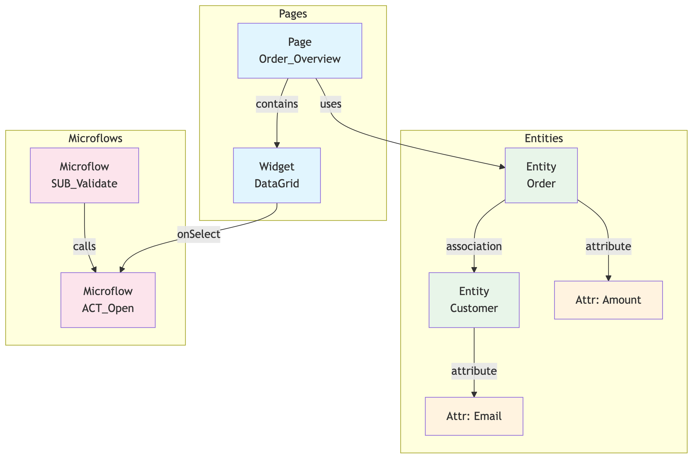


**Node Types**: Entity, Attribute, Association, Page, Microflow, Widget, ...
**Edge Types**: has_attribute, association, uses, contains, calls, ...

### Option A: SPARQL Interface

SPARQL (SPARQL Protocol and RDF Query Language) is the W3C standard for querying RDF graphs:

```sparql
PREFIX mx: <http://mendix.com/model#>

# Find all entities with their attributes
SELECT ?entity ?attrName ?attrType
WHERE {
  ?entity a mx:Entity .
  ?entity mx:hasAttribute ?attr .
  ?attr mx:name ?attrName .
  ?attr mx:type ?attrType .
}

# Find entities reachable from Customer within 3 association hops
SELECT ?entity ?path
WHERE {
  mx:CRM.Customer (mx:association)* ?entity .
  FILTER (?entity != mx:CRM.Customer)
}

# Find circular dependencies (entities that reference each other)
SELECT ?entity1 ?entity2
WHERE {
  ?entity1 mx:association ?entity2 .
  ?entity2 mx:association ?entity1 .
  FILTER (?entity1 < ?entity2)  # Avoid duplicates
}

# Find all microflows that could affect Customer data
SELECT ?microflow
WHERE {
  ?microflow a mx:Microflow .
  ?microflow mx:usesEntity mx:CRM.Customer .
}

# CONSTRUCT a subgraph for export
CONSTRUCT {
  ?entity a mx:Entity .
  ?entity mx:hasAttribute ?attr .
  ?entity mx:association ?target .
}
WHERE {
  ?entity mx:inModule mx:CRM .
  OPTIONAL { ?entity mx:hasAttribute ?attr }
  OPTIONAL { ?entity mx:association ?target }
}
```

**SPARQL Advantages:**
- W3C standard with mature tooling
- Powerful pattern matching
- CONSTRUCT for graph extraction
- Federated queries across models

### Option B: Cypher Interface

Cypher (used by Neo4j) offers a more visual, ASCII-art-like syntax:

```cypher
// Find all entities with their attributes
MATCH (e:Entity)-[:HAS_ATTRIBUTE]->(a:Attribute)
RETURN e.name, a.name, a.type

// Find path from Order to Customer (any length)
MATCH path = (o:Entity {name: 'Order'})-[:ASSOCIATION*1..5]->(c:Entity {name: 'Customer'})
RETURN path

// Find circular dependencies
MATCH (e1:Entity)-[:ASSOCIATION]->(e2:Entity)-[:ASSOCIATION]->(e1)
WHERE id(e1) < id(e2)
RETURN e1.name, e2.name

// Find impact of changing Customer entity
MATCH (c:Entity {name: 'Customer'})<-[:USES|ASSOCIATION*1..3]-(dependent)
RETURN DISTINCT dependent.name, labels(dependent)[0] AS type

// Clone a module's structure
MATCH (m:Module {name: 'CRM'})-[*]->(n)
RETURN m, n

// Find orphaned entities (no associations, no page usage)
MATCH (e:Entity)
WHERE NOT (e)-[:ASSOCIATION]-()
  AND NOT ()-[:USES]->(e)
RETURN e.name AS orphaned_entity

// Bulk update: Add audit fields to all entities in module
MATCH (e:Entity)-[:IN_MODULE]->(m:Module {name: 'CRM'})
WHERE NOT (e)-[:HAS_ATTRIBUTE]->(:Attribute {name: 'CreatedDate'})
CREATE (e)-[:HAS_ATTRIBUTE]->(a:Attribute {name: 'CreatedDate', type: 'DateTime'})
RETURN e.name, a.name
```

**Cypher Advantages:**
- Visual, intuitive syntax
- Excellent for path queries
- Read and write in same language
- Popular in developer community

### Option C: GraphQL Interface

GraphQL provides a typed, hierarchical query interface:

```graphql
# Schema
type Entity {
  id: ID!
  name: String!
  module: Module!
  attributes: [Attribute!]!
  associations: [Association!]!
  usedByPages: [Page!]!
  usedByMicroflows: [Microflow!]!
}

type Query {
  entity(name: String!): Entity
  entities(module: String): [Entity!]!
  impactAnalysis(entityName: String!, depth: Int): ImpactResult!
  pathBetween(from: String!, to: String!): [Path!]!
}

type Mutation {
  createEntity(input: CreateEntityInput!): Entity!
  addAttribute(entityName: String!, attribute: AttributeInput!): Attribute!
  bulkAddAttribute(filter: EntityFilter!, attribute: AttributeInput!): [Entity!]!
}

# Query: Get entity with all relationships
query GetCustomerImpact {
  entity(name: "CRM.Customer") {
    name
    attributes {
      name
      type
    }
    associations {
      name
      targetEntity {
        name
      }
    }
    usedByPages {
      name
      widgets {
        type
      }
    }
    usedByMicroflows {
      name
      actions {
        type
      }
    }
  }
}

# Mutation: Add audit fields to multiple entities
mutation AddAuditFields {
  bulkAddAttribute(
    filter: { module: "CRM" }
    attribute: { name: "CreatedDate", type: DATETIME }
  ) {
    name
  }
}
```

**GraphQL Advantages:**
- Strongly typed with schema
- Hierarchical, matches model structure
- Efficient (fetch only needed fields)
- Great tooling (GraphiQL, Apollo)

### Comparison Matrix

| Capability | SQL Catalog | SPARQL | Cypher | GraphQL |
|------------|-------------|--------|--------|---------|
| Simple queries | ✅ Excellent | ✅ Good | ✅ Good | ✅ Excellent |
| Path queries | ❌ Recursive CTEs | ✅ Native | ✅ Excellent | ⚠️ Limited |
| Pattern matching | ⚠️ Limited | ✅ Excellent | ✅ Excellent | ❌ No |
| Graph algorithms | ❌ No | ⚠️ Extensions | ✅ Built-in | ❌ No |
| Write operations | ✅ Via MDL | ✅ SPARQL Update | ✅ Native | ✅ Mutations |
| Type safety | ⚠️ Runtime | ⚠️ Runtime | ⚠️ Runtime | ✅ Schema |
| Tooling | ✅ Ubiquitous | ✅ Good | ✅ Good | ✅ Excellent |
| AI familiarity | ✅ Very High | ⚠️ Medium | ⚠️ Medium | ✅ High |

### Recommended Approach: Hybrid Architecture

Rather than choosing one, offer multiple interfaces to the same underlying graph:


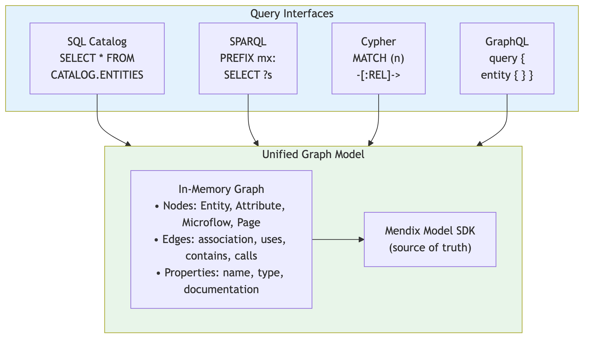


### Use Cases by Query Language

| Use Case | Best Language | Example |
|----------|---------------|---------|
| **Simple lookups** | SQL | `SELECT * FROM CATALOG.ENTITIES WHERE Name = 'Customer'` |
| **Impact analysis** | Cypher | `MATCH (e)<-[:USES*1..3]-(dep) RETURN dep` |
| **Pattern detection** | SPARQL | Find all entities matching a naming pattern |
| **API for UI** | GraphQL | VS Code extension fetching model structure |
| **Bulk modifications** | Cypher | Add attributes to all entities in a module |
| **Export subgraph** | SPARQL | CONSTRUCT query for module extraction |
| **AI agent queries** | GraphQL/SQL | Structured, typed responses |

### AI Agent Benefits

Graph queries enable powerful AI agent capabilities:


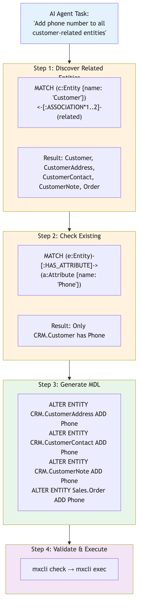


### Implementation Considerations

#### Option 1: Embedded Graph Database

Use an embedded graph database like **DuckDB** (SQL) + custom graph extensions:

```typescript
// Build graph on project load
const graph = new MendixModelGraph();
await graph.loadFromModel(model);

// Query via SQL with graph functions
const result = await graph.query(`
  SELECT * FROM graph_traverse(
    'CRM.Customer',
    'ASSOCIATION',
    3  -- max depth
  )
`);
```

#### Option 2: RDF Triple Store

Export model to RDF, query via SPARQL:

```typescript
// Export model to RDF triples
const triples = await modelToRDF(model);
const store = new N3.Store(triples);

// Query via SPARQL
const results = await store.query(`
  PREFIX mx: <http://mendix.com/model#>
  SELECT ?entity WHERE {
    ?entity a mx:Entity .
    ?entity mx:inModule mx:CRM .
  }
`);
```

#### Option 3: Virtual Graph Layer

Keep data in Model SDK, translate queries on-the-fly:

```typescript
// Query parsed and translated to Model SDK calls
const query = parseGraphQL(`
  query {
    entity(name: "CRM.Customer") {
      associations {
        targetEntity { name }
      }
    }
  }
`);

// Executed against Model SDK
const result = await executeQuery(query, model);
```

### Recommendation

**Phase 1 (Current)**: ✅ SQL CATALOG with REFS table and search commands
- REFS table tracks cross-references (call, create, retrieve, show_page, etc.)
- High-level commands: `callers`, `callees`, `refs`, `impact`, `context`, `search`
- Sufficient for most AI agent code navigation needs
- Familiar SQL interface with practical abstractions

**Phase 2 (Near-term)**: Add Cypher support via embedded graph
- Best path/relationship queries (multi-hop traversals)
- Pattern matching for detecting anti-patterns
- Write operations feel natural

**Phase 3 (Future)**: Add GraphQL for VS Code extension and typed API access
- Schema-first development
- Excellent tooling (GraphiQL, code generation)
- Efficient for UI queries

---

## Language Server: Serving Humans and AI

### The Dual-Purpose Design

The MDL Language Server is architected to serve both audiences:


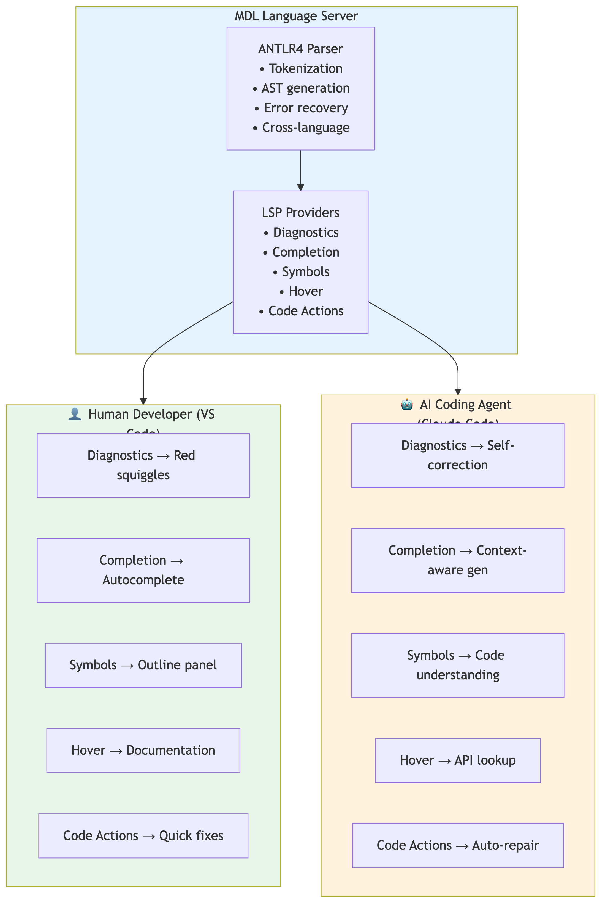


### LSP Features: Human vs AI Usage

| LSP Feature | Human Experience | AI Agent Experience |
|-------------|------------------|---------------------|
| **textDocument/diagnostic** | See red/yellow squiggles inline | Parse errors to identify what to fix |
| **textDocument/completion** | Press Tab to complete | Get valid options for generation |
| **textDocument/documentSymbol** | Navigate via Outline panel | Understand existing code structure |
| **textDocument/hover** | Read documentation tooltip | Lookup syntax and semantics |
| **textDocument/definition** | Ctrl+Click to navigate | Resolve references |
| **textDocument/codeAction** | Click lightbulb for fixes | Auto-apply suggested fixes |
| **textDocument/formatting** | Shift+Alt+F to format | Ensure consistent output |

### AI-Specific Features (Future)

Beyond standard LSP, we can add AI-optimized capabilities:

```typescript
// Custom LSP extension for AI agents
interface AICapabilities {
  // Generate MDL from natural language
  'mdl/generateFromDescription': {
    description: string;
    context?: string[];  // Existing entities for reference
  } => { mdl: string; confidence: number };

  // Suggest fixes with explanations
  'mdl/explainError': {
    diagnostic: Diagnostic;
  } => { explanation: string; suggestedFix: string };

  // Batch validation for efficiency
  'mdl/validateBatch': {
    documents: TextDocument[];
  } => { diagnostics: Map<string, Diagnostic[]> };

  // Semantic search
  'mdl/search': {
    query: string;
    type?: 'entity' | 'microflow' | 'page' | 'all';
  } => { results: SearchResult[] };
}
```

---

## VS Code Extension: The Human Interface

### Why VS Code Matters

Even with AI generation, humans need to:
- **Review** generated code before deployment
- **Understand** what was generated
- **Modify** AI output for edge cases
- **Debug** issues in generated applications

The VS Code extension provides the human-friendly interface to MDL:

### Feature Matrix

| Feature | Human Benefit | AI Synergy |
|---------|---------------|------------|
| **Syntax Highlighting** | Readable code | - |
| **Error Squiggles** | Spot mistakes quickly | AI sees same errors |
| **Outline View** | Navigate large files | AI understands structure |
| **Autocomplete** | Faster manual coding | AI gets same suggestions |
| **Hover Documentation** | Learn syntax | AI can lookup too |
| **Go to Definition** | Navigate codebase | AI can follow references |
| **Format Document** | Consistent style | AI output is formatted |
| **Code Actions** | Quick fixes | AI can apply fixes |

### The Review Workflow


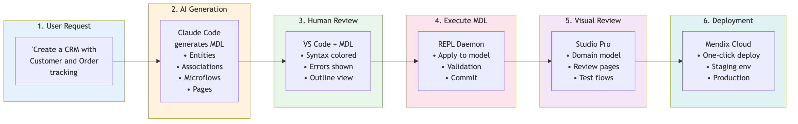


---

## Platform Guarantees: Why Enterprises Trust Mendix

### Security by Default

Unlike AI-generated traditional code, Mendix applications inherit platform security:

| Security Concern | Traditional Code Risk | Mendix Guarantee |
|------------------|----------------------|------------------|
| **SQL Injection** | Must sanitize all inputs | ORM prevents by design |
| **XSS Attacks** | Must escape all output | Template engine escapes |
| **Authentication** | Must implement correctly | Built-in user management |
| **Authorization** | Must check every endpoint | Declarative role-based access |
| **Data Exposure** | Must filter API responses | Entity access rules |
| **CSRF** | Must implement tokens | Platform handles |
| **Session Management** | Must implement securely | Platform handles |

### Validation Pipeline


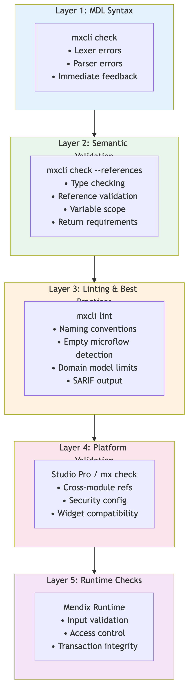


### Governance & Compliance

| Requirement | How Mendix Addresses |
|-------------|---------------------|
| **Audit Trail** | Model versioning, commit history |
| **Change Review** | Visual diff in Studio Pro |
| **Separation of Concerns** | Module security, app roles |
| **Compliance Certifications** | SOC 2, ISO 27001, GDPR |
| **Data Residency** | Regional cloud deployments |
| **Backup & Recovery** | Platform-managed |

---

## Legacy Migration: AI-Assisted Modernization

### The Migration Opportunity

Enterprises have massive investments in legacy business applications that are increasingly difficult to maintain:

| Platform Type | Examples | Migration Challenges |
|---------------|----------|---------------------|
| **Legacy Low-Code** | OutSystems, K2, Appian, Pega | Proprietary formats, vendor lock-in, limited export |
| **3GL Business Apps** | Java/Spring, .NET/C#, COBOL | Large codebases, tribal knowledge, documentation gaps |
| **Database-Centric** | Oracle Forms, MS Access, FoxPro | Tight DB coupling, stored procedures, no separation |
| **Custom Frameworks** | Internal RAD tools, 4GL systems | Unique syntax, no community, skills shortage |

**AI + MDL enables a new approach**: Use agentic IDEs to understand legacy systems and generate equivalent Mendix applications.

### Migration Architecture


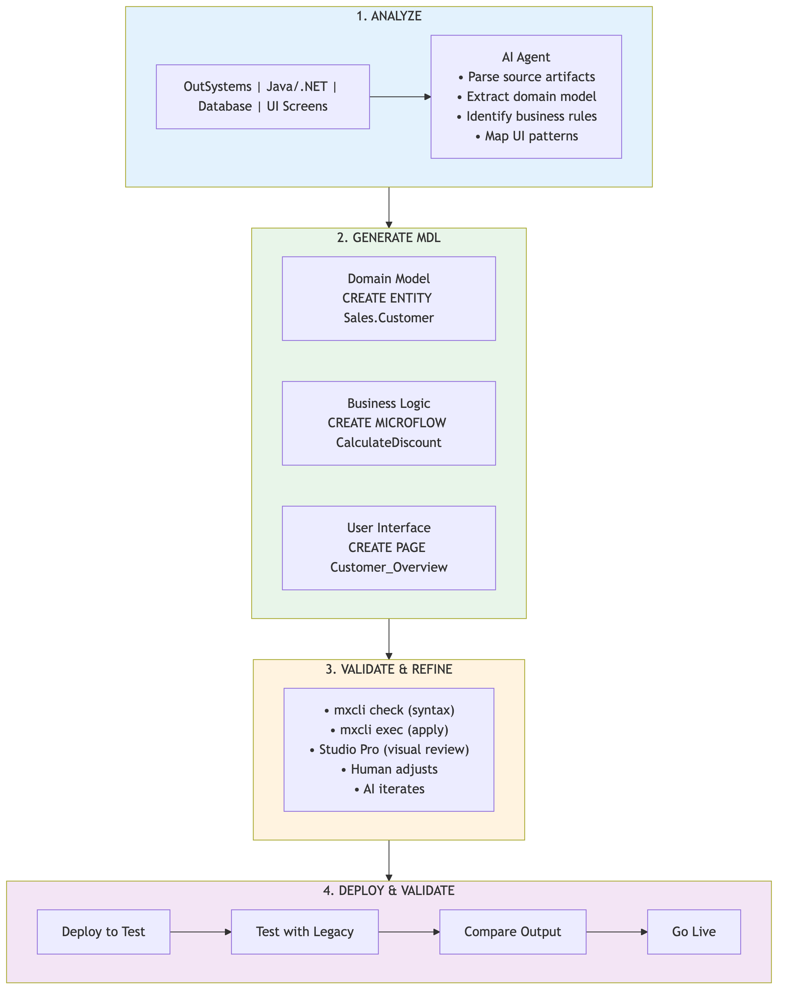


### Migration by Source Platform

#### From OutSystems / Other Low-Code

OutSystems, Appian, K2, and similar platforms have structured models that map well to Mendix:

| OutSystems Concept | Mendix Equivalent | MDL Syntax |
|-------------------|-------------------|------------|
| Entity | Entity | `CREATE ENTITY` |
| Entity Attribute | Attribute | `Name: String(200)` |
| Entity Reference | Association | `CREATE ASSOCIATION` |
| Screen | Page | `CREATE PAGE` |
| Server Action | Microflow | `CREATE MICROFLOW` |
| Client Action | Nanoflow | `CREATE NANOFLOW` |
| Web Block | Snippet | `CREATE SNIPPET` |
| Static Entity | Enumeration | `CREATE ENUMERATION` |

**AI Migration Workflow:**


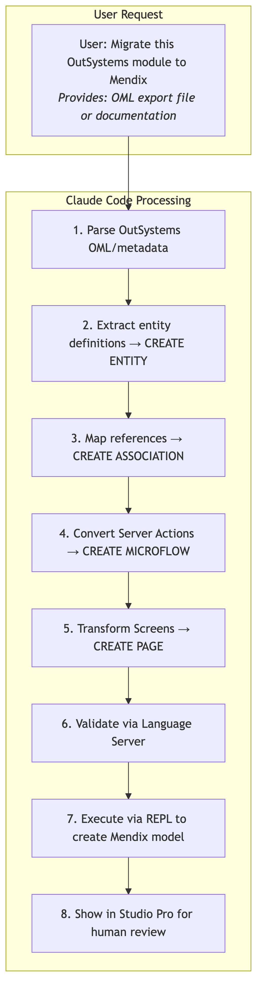


**Example: OutSystems Entity to MDL**

OutSystems Entity (conceptual):
```
Entity: Customer
  Id: Integer (Auto Number)
  Name: Text (200)
  Email: Text (200)
  IsActive: Boolean (Default: True)
  CreatedOn: DateTime (Default: CurrentDateTime)
```

Generated MDL:
```sql
CREATE PERSISTENT ENTITY Migration.Customer (
  Name: String(200) NOT NULL,
  Email: String(200),
  IsActive: Boolean DEFAULT true,
  CreatedOn: DateTime DEFAULT '[%CurrentDateTime%]'
);
```

#### From Java/.NET Business Applications

Traditional 3GL applications require deeper analysis but follow patterns:

| Java/.NET Pattern | Mendix Equivalent | MDL Approach |
|-------------------|-------------------|--------------|
| JPA Entity / EF Model | Entity | Extract from annotations/attributes |
| Repository / DAO | Built-in | Mendix handles persistence |
| Service Class | Microflow | Convert method → microflow logic |
| Controller | Page + Microflow | Map endpoints to pages |
| DTO | Entity or Non-persistent Entity | Depends on usage |
| Validation | Validation Microflow | Convert validation rules |

**AI Migration Workflow:**


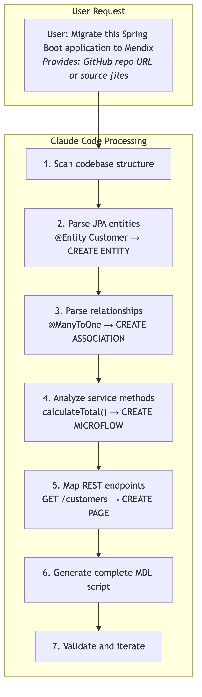


**Example: Spring Boot to MDL**

Java Entity:
```java
@Entity
@Table(name = "customers")
public class Customer {
    @Id @GeneratedValue
    private Long id;

    @Column(length = 200, nullable = false)
    private String name;

    @Column(length = 200)
    private String email;

    @OneToMany(mappedBy = "customer")
    private List<Order> orders;

    @Column(precision = 10, scale = 2)
    private BigDecimal creditLimit;
}
```

Generated MDL:
```sql
CREATE PERSISTENT ENTITY CRM.Customer (
  Name: String(200) NOT NULL,
  Email: String(200),
  CreditLimit: Decimal
);

CREATE ASSOCIATION CRM.Order_Customer
  BETWEEN CRM.Order AND CRM.Customer
  TYPE REFERENCE;
```

Java Service:
```java
@Service
public class CustomerService {
    public BigDecimal calculateDiscount(Order order) {
        Customer customer = order.getCustomer();
        if (customer.isPreferred()) {
            return order.getTotal().multiply(new BigDecimal("0.10"));
        }
        return BigDecimal.ZERO;
    }
}
```

Generated MDL:
```sql
CREATE MICROFLOW CRM.CalculateDiscount (
  $Order: CRM.Order
)
RETURNS Decimal
BEGIN
  RETRIEVE $Customer FROM $Order/Order_Customer;
  IF $Customer/IsPreferred THEN
    RETURN $Order/Total * 0.10;
  END IF;
  RETURN 0;
END;
```

#### From Database-Centric Applications

Oracle Forms, MS Access, and similar tools store logic in the database:

| Legacy Pattern | Migration Approach |
|----------------|-------------------|
| Table | `CREATE ENTITY` from DDL |
| View | `CREATE VIEW ENTITY` with OQL |
| Stored Procedure | `CREATE MICROFLOW` with equivalent logic |
| Trigger | Before/After commit microflow |
| Form | `CREATE PAGE` with data widgets |
| Report | Page with DataGrid or external reporting |

**AI Migration Workflow:**

```sql
-- Input: Oracle DDL + PL/SQL
CREATE TABLE customers (
  customer_id NUMBER PRIMARY KEY,
  name VARCHAR2(200) NOT NULL,
  credit_limit NUMBER(10,2) DEFAULT 0
);

CREATE PROCEDURE apply_discount(p_order_id NUMBER) AS
  v_total NUMBER;
  v_discount NUMBER;
BEGIN
  SELECT total INTO v_total FROM orders WHERE order_id = p_order_id;
  v_discount := v_total * 0.1;
  UPDATE orders SET discount = v_discount WHERE order_id = p_order_id;
END;
```

Generated MDL:
```sql
-- Entity from table
CREATE PERSISTENT ENTITY Legacy.Customer (
  Name: String(200) NOT NULL,
  CreditLimit: Decimal DEFAULT 0
);

-- Microflow from stored procedure
CREATE MICROFLOW Legacy.ApplyDiscount ($Order: Legacy.Order)
BEGIN
  CHANGE $Order SET Discount = $Order/Total * 0.10;
  COMMIT $Order;
END;
```

### Migration Tooling in VS Code

The VS Code extension enhances the migration experience:


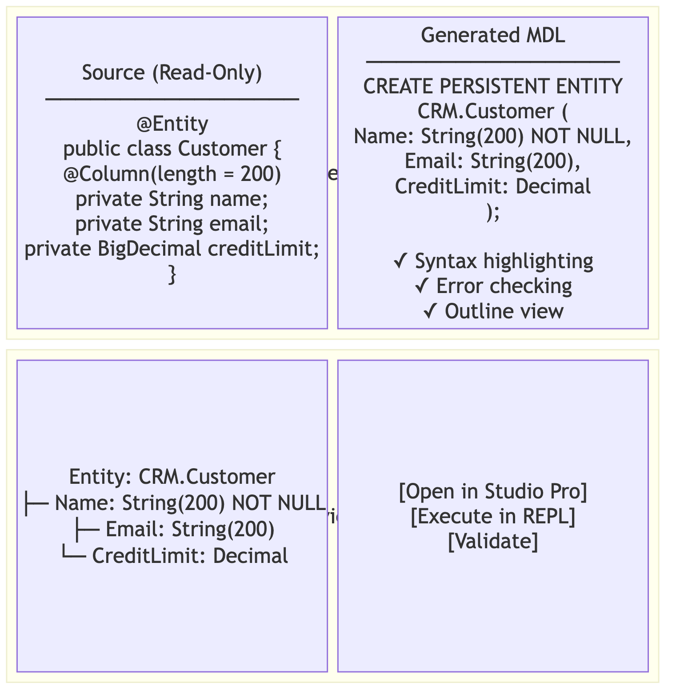


### Migration Benefits with AI + MDL

| Benefit | Description |
|---------|-------------|
| **Speed** | AI can analyze and generate thousands of lines of MDL in minutes |
| **Consistency** | Same patterns applied across entire codebase |
| **Accuracy** | Language Server validates every generated statement |
| **Iteration** | Easy to refine: adjust prompt, regenerate, validate |
| **Review** | Concise MDL is easier to review than equivalent Java/.NET |
| **Traceability** | Can document source-to-target mapping |
| **Risk Reduction** | Mendix platform guarantees reduce security/quality risks |

### Migration Phases


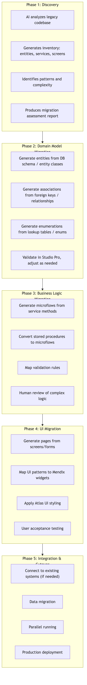


### ROI of AI-Assisted Migration

| Factor | Traditional Migration | AI + MDL Migration |
|--------|----------------------|-------------------|
| **Analysis Time** | Weeks of manual review | Hours with AI scanning |
| **Code Generation** | Manual rewrite | AI generates 70-80% |
| **Review Effort** | Review all generated code | Review concise MDL |
| **Iteration Speed** | Days per change | Minutes per change |
| **Consistency** | Depends on team | AI applies patterns uniformly |
| **Documentation** | Often skipped | AI can generate alongside |
| **Risk** | High (manual errors) | Lower (platform validation) |
| **Total Duration** | 12-24 months | 4-8 months |
| **Cost Reduction** | Baseline | 50-70% reduction |

---

## Implementation Roadmap

### Phase 1: Foundation

**Status**: ✅ Completed

- [x] MDL Parser (ANTLR4-based, cross-language grammar)
- [x] REPL with connection management
- [x] Basic CRUD operations (Entity, Association, Enumeration)
- [x] CATALOG queries for searching
- [x] VS Code extension with syntax highlighting
- [x] Language Server with diagnostics and symbols

### Phase 2: AI Readiness

**Status**: ✅ Completed

- [x] **mxcli**: Single unified CLI for AI agents (Cobra-based)
  - `mxcli exec` - Execute MDL scripts
  - `mxcli check` - Syntax and semantic validation
  - `mxcli diff` - Compare script against project state
  - `mxcli diff-local` - Compare local changes against git (MPR v2)
  - `mxcli lint` - Extensible linting framework
  - `mxcli describe` - Describe entities, microflows, pages
  - `mxcli init` - Initialize Claude Code integration in Mendix projects
- [x] **Enhanced CATALOG**:
  - REFS table tracking cross-references (call, create, retrieve, show_page, etc.)
  - Code search commands: `SHOW CALLERS`, `SHOW CALLEES`, `SHOW REFERENCES`, `SHOW IMPACT`, `SHOW CONTEXT`
  - Full-text `SEARCH` command
  - Widget discovery: `SHOW WIDGETS`
- [x] **Linting Framework**: Extensible rules with multiple output formats
  - MDL001 (NamingConvention) - PascalCase enforcement
  - MDL002 (EmptyMicroflow) - Detect empty microflows
  - MDL003 (DomainModelSize) - Entity count limits
  - MDL004 (ValidationFeedback) - Non-empty message check
  - SARIF output for CI/GitHub integration
- [x] **Documentation**: AI-friendly skills in `.claude/skills/`
  - `write-microflows.md` - Microflow syntax and patterns
  - `create-page.md` - V3 page/widget syntax
  - `overview-pages.md` - CRUD page patterns
  - `master-detail-pages.md` - Master-detail patterns
  - `generate-domain-model.md` - Entity/Association syntax
  - `check-syntax.md` - Pre-flight validation checklist
  - `debug-bson.md` - BSON debugging workflow
- [x] **Microflow Body Validation**: AST-level semantic checks
  - Return value requirements
  - Variable scope validation
  - VALIDATION FEEDBACK message checks (CE0091)
- [ ] **Completion Provider**: Context-aware suggestions
- [ ] **Code Actions**: Auto-fix common errors

### Phase 3: Agentic Integration

**Status**: 🔄 In Progress

- [x] **Claude Code Integration**: `mxcli init` creates `.claude/` folder with skills and commands
- [x] **Semantic Search**: `SEARCH` command for full-text search across project
- [x] **Batch Operations**: `UPDATE WIDGETS` for bulk widget property updates (experimental)
- [ ] **Claude Code MCP Server**: Native tool integration
- [ ] **Cursor Extension**: IDE-specific features
- [ ] **GitHub Copilot**: Custom instructions support

### Phase 4: Enterprise Features

**Status**: 🔄 Planned

- [ ] **Security Model in MDL**: Role-based access definition
- [ ] **Testing Framework**: Automated test generation
- [ ] **CI/CD Integration**: Pipeline tooling (SARIF output available)
- [ ] **Multi-Project Support**: Cross-app references
- [ ] **Governance Dashboard**: AI generation tracking

---

## Success Metrics

### Adoption Metrics

| Metric | Target | Measurement |
|--------|--------|-------------|
| **AI-Generated Apps** | 1000+ apps/month | Platform telemetry |
| **Token Efficiency** | 5x vs TypeScript | Benchmark tests |
| **Generation Accuracy** | 95%+ valid syntax | LSP error rates |
| **User Satisfaction** | NPS > 50 | Survey |

### Quality Metrics

| Metric | Target | Measurement |
|--------|--------|-------------|
| **Validation Coverage** | 100% of AI output | Platform checks |
| **Security Incidents** | 0 AI-related | Security team |
| **Production Readiness** | 80%+ first-time | Deployment success |
| **Review Time** | <10 min avg | User studies |

---

## Strategic Positioning: The Open AI-Ready Platform

### Competitive Moat

Mendix's approach to AI agent integration creates sustainable competitive advantages:


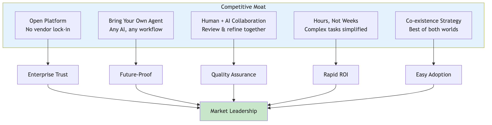


### 1. Open Low-Code Platform

**First mover advantage**: Mendix is the first low-code platform to offer full AI agent integration through open, non-proprietary interfaces.

| Openness Aspect | Implementation |
|-----------------|----------------|
| **Open DSL** | MDL grammar published, parsers available in multiple languages (ANTLR4) |
| **Open Tooling** | mxcli is open-source, works with any terminal-capable agent |
| **Open Integration** | Standard file formats, Git-compatible, CI/CD ready |
| **No Proprietary Protocol** | No special MCP server required—standard file and CLI operations |

**Contrast with competitors**: Other low-code platforms either lack textual representations entirely, or require proprietary integrations that lock customers into specific AI vendors.

### 2. Bring Your Own Agent (BYOA)

Enterprises can choose their preferred AI agent without being locked into a specific vendor:

| Agent | Integration Method | Status |
|-------|-------------------|--------|
| **Claude Code** | Native CLI + skills via `mxcli init` | ✅ Supported |
| **GitHub Copilot** | Workspace + terminal access | ✅ Supported |
| **Cursor** | Terminal + file editing | ✅ Supported |
| **Windsurf** | Agentic flows + CLI | ✅ Supported |
| **Custom/Internal Agents** | CLI + MDL grammar | ✅ Supported |
| **Future Agents** | Any agent with file/CLI access | ✅ Ready |

**Strategic value**: As AI agents evolve rapidly, enterprises are not locked into today's best option. They can switch agents as the market evolves, or use different agents for different tasks.

### 3. Built for True Collaboration

The platform is designed for humans and AI to work together, not to replace one with the other:


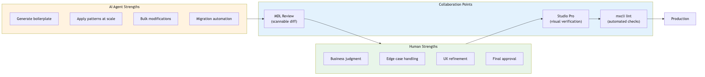


**Key design decisions**:
- MDL diffs are human-scannable (unlike JSON or procedural code)
- Validation happens at multiple layers (syntax → semantic → lint → platform)
- Visual review in Studio Pro provides final human checkpoint
- Atomic commits ensure human approval before changes take effect

### 4. Hours, Not Weeks

Complex enterprise use cases become achievable in hours instead of weeks:

| Use Case | Traditional Approach | With MDL + AI Agent |
|----------|---------------------|---------------------|
| **Legacy Migration** | Months of manual analysis and rewrite | AI analyzes source, generates MDL, human reviews |
| **Bulk Application Updates** | Manual changes across 50+ apps | Script generates MDL diffs, batch apply with review |
| **Monolith Decomposition** | Weeks of refactoring | AI proposes module boundaries, generates extraction plan |
| **Compliance Updates** | Touch every entity/microflow manually | Pattern-based bulk updates via MDL |
| **API Versioning** | Manual endpoint updates | AI generates new version, preserves old |

**Example: Bulk Update Across Applications**

```bash
# Update all ComboBox widgets across 50 applications
for app in apps/*.mpr; do
  mxcli -p "$app" -c "UPDATE WIDGETS SET 'showLabel' = false WHERE WidgetType LIKE '%combobox%'"
done

# Time: ~30 minutes (including review)
# Traditional: ~2 weeks of manual work
```

### 5. Co-existence Strategy

Best of both worlds—visual development and AI automation coexist:

| Workflow | Tool | User |
|----------|------|------|
| **Visual design** | Studio Pro | Business developers, UX designers |
| **Bulk operations** | mxcli + AI | DevOps, platform teams |
| **Feature generation** | AI agent + MDL | Full-stack developers |
| **Review & refinement** | Studio Pro | All stakeholders |
| **CI/CD automation** | mxcli + scripts | Platform engineering |

**No forced migration**: Teams can adopt AI-assisted development gradually. Visual developers continue using Studio Pro. Power users leverage CLI and AI. Both work on the same projects seamlessly.

### Strategic Implications

| For Mendix | For Enterprises | For the Market |
|------------|-----------------|----------------|
| Capture AI-native developers | Reduce development costs 50%+ | Set standard for AI + low-code |
| Differentiate from competitors | Future-proof platform choice | Drive low-code evolution |
| Enable new use cases (migration) | Accelerate digital transformation | Expand addressable market |
| Build ecosystem (agents, skills) | Maintain governance & control | Create network effects |

---

## Conclusion

Mendix is uniquely positioned to become the platform of choice for AI-generated business applications:

1. **MDL provides token efficiency**: 5-10x more concise than traditional code
2. **Platform guarantees reduce risk**: Security, validation, and governance built-in
3. **Language Server enables AI**: Real-time feedback for self-correction
4. **VS Code extension aids review**: Humans can validate AI output
5. **Visual tools complete the loop**: Studio Pro for final review and deployment

By investing in MDL tooling for agentic IDEs, Mendix can capture the emerging market of AI-assisted enterprise application development while maintaining the trust and governance that enterprises require.

---

## Appendix: Competitive Analysis

### Alternative Approaches

| Approach | Pros | Cons |
|----------|------|------|
| **Traditional Code (TypeScript/Python)** | Flexible, large ecosystem | Verbose, security risks, review burden |
| **No-Code Platforms** | Visual, accessible | Limited AI generation capability |
| **Other Low-Code (OutSystems, Appian)** | Similar guarantees | No textual DSL for AI |
| **Infrastructure as Code (Terraform)** | Declarative | Not application-focused |

### Mendix Differentiation

1. **Only low-code platform with mature textual DSL**
2. **Bidirectional: Text ↔ Visual**
3. **Enterprise-grade platform guarantees**
4. **Existing ecosystem of developers**
5. **Proven at scale (thousands of apps)**

---

## References

- [Claude Code Documentation](https://docs.anthropic.com/claude-code)
- [Language Server Protocol](https://microsoft.github.io/language-server-protocol/)
- [Mendix Model SDK](https://docs.mendix.com/apidocs-mxsdk/mxsdk/)
- [MDL Syntax Reference](../02-features/)
- [VS Code MDL Extension](../../packages/vscode-mdl/)
- [mxcli Commands](../../cmd/mxcli/) - CLI implementation
- [MDL Grammar (ANTLR4)](../../mdl/grammar/) - Parser grammar definition
- [Skill Templates](../../reference/mendix-repl/templates/.claude/skills/) - Built-in skill files
- [Linting Rules](../../mdl/linter/rules/) - Built-in lint rules
