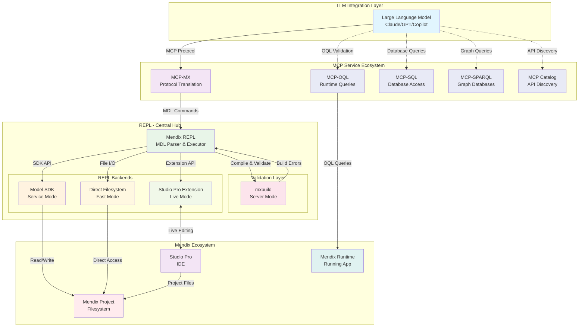
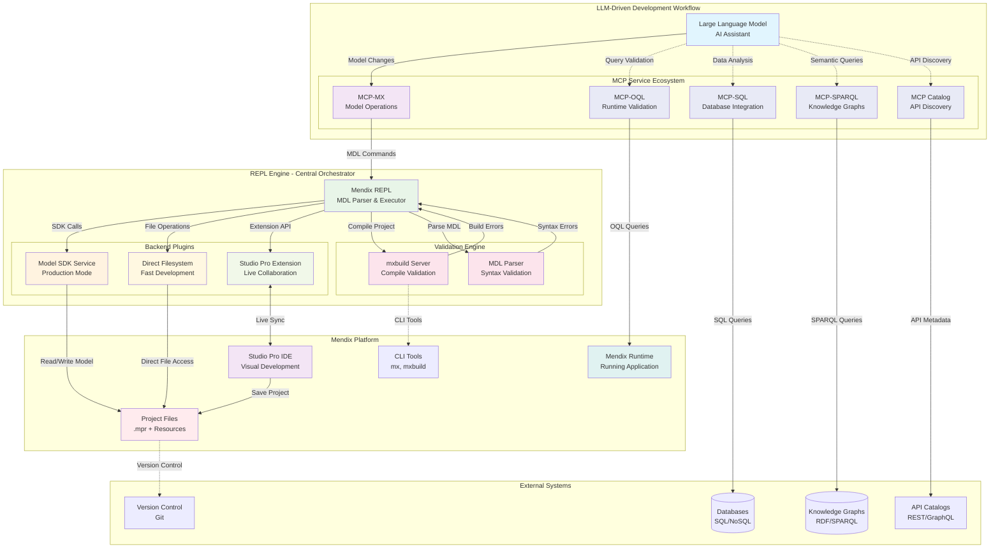
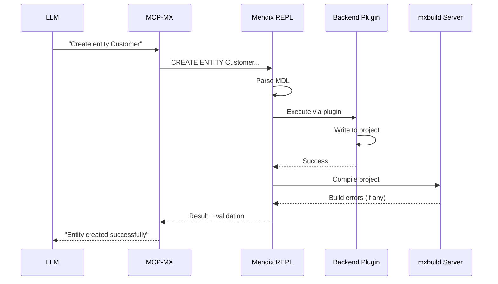
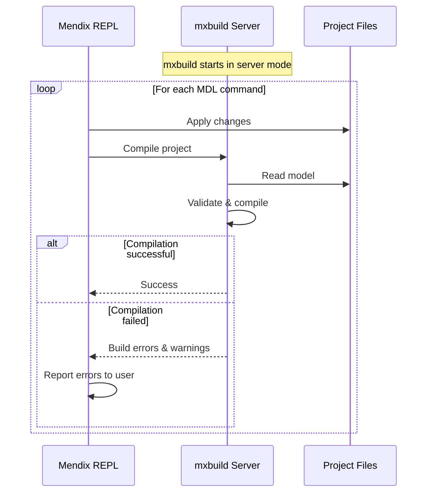
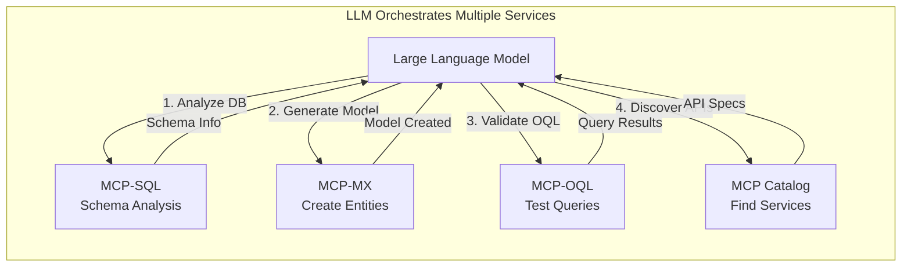
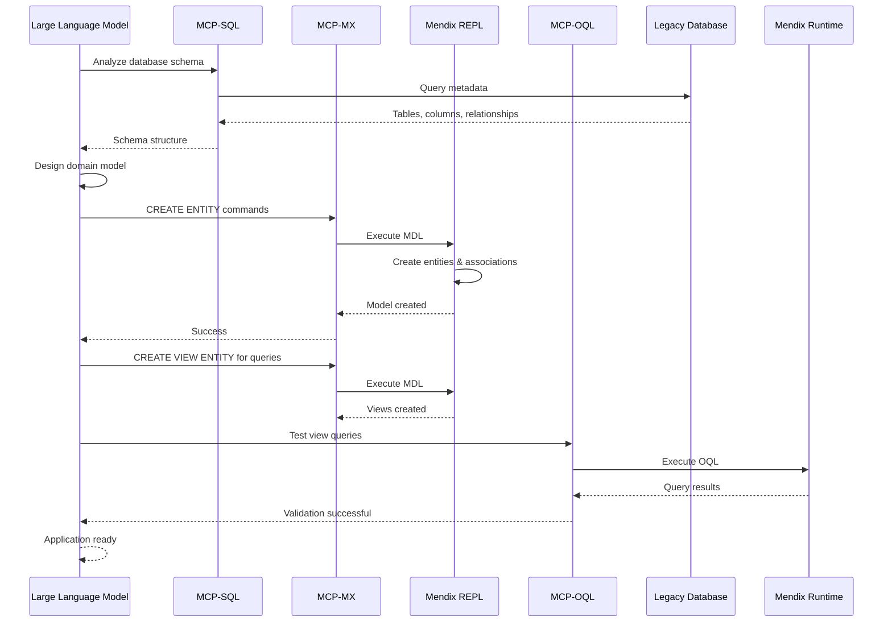
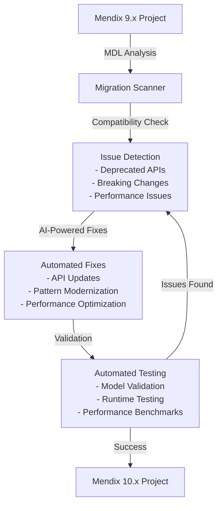
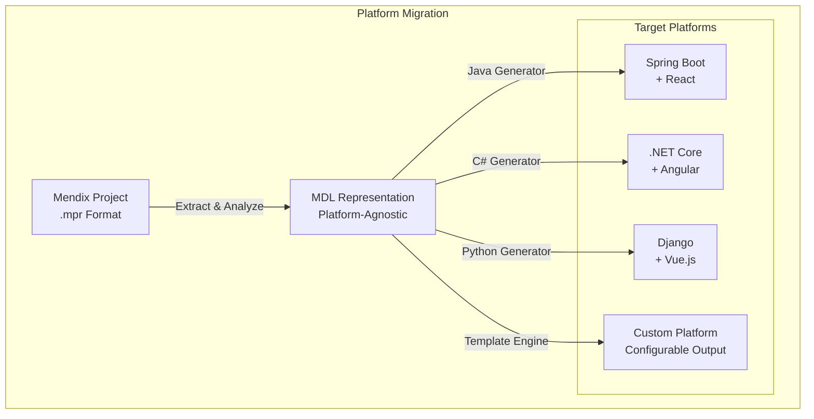

# Project Vision: Mendix Model Context Protocol (MCP-MX)

## Executive Summary

The Mendix Model Context Protocol (MCP-MX) project provides a bridge between Large Language Models (LLMs) and the Mendix platform through a standardised, text-based interface. The project enables AI-assisted development, migration, and maintenance of Mendix applications using the Mendix Model Definition Language (MDL).

## Current State

### Architecture Overview

The MCP-MX architecture separates concerns between protocol translation (MCP server) and model manipulation (REPL). The REPL serves as the central hub for all Mendix model operations, whilst the LLM uses specialised MCP services for external integrations.

### Key Components

1. **MCP-MX Server**: Protocol translation layer - converts MCP protocol to MDL commands
2. **Mendix REPL**: Central hub for model manipulation with pluggable backends
3. **REPL Backends**: 
   - **Model SDK Service**: Remote SDK for production use
   - **Direct Filesystem**: Fast local file manipulation
   - **Studio Pro Extension**: Live editing in open IDE
4. **Validation Layer**: mxbuild in server mode for compile-time validation
5. **External MCP Services**: Specialized services for runtime queries and 3rd party integrations

### Current Capabilities

- **Model Inspection**: LLMs can query domain models, microflows, and pages
- **Model Modification**: Create and modify entities, attributes, and associations
- **SQL-like Syntax**: Familiar query interface for model operations
- **Safe Operations**: Sandboxed environment for AI-generated changes

## Future Vision

### Enhanced Architecture with Validation and External Services

The enhanced architecture emphasizes the REPL as the central orchestrator with pluggable backends, integrated validation, and specialized MCP services for external integrations.

### Enhanced Capabilities Roadmap

#### 1. REPL Backend Plugins

The REPL supports multiple backend implementations, each optimized for different use cases:

**Model SDK Service Backend**
- Remote SDK service for production environments
- Full model API coverage
- Safe, transactional operations
- Currently implemented

**Direct Filesystem Backend**
- Significantly faster than SDK for bulk operations
- Direct XML manipulation for .mpr files
- Access to all project resources (images, stylesheets, etc.)
- Planned implementation

**Studio Pro Extension Backend**
- Live collaboration with developers in IDE
- Real-time visual feedback
- Seamless integration with existing workflows
- Future implementation

#### 2. Integrated Validation with mxbuild

**Benefits**:
- Compile-time validation of all model changes
- Immediate feedback on errors and warnings
- Ensures model consistency and correctness

The REPL integrates with mxbuild running in server mode to provide continuous validation:

#### 3. External MCP Services Integration

**Benefits**:
- Specialized services for different integration needs
- LLM can orchestrate multiple services
- Separation of concerns for better maintainability

**MCP-OQL** (Runtime Query Validation)
- Execute OQL queries against running Mendix runtime
- Validate OQL syntax and semantics
- Test view entity definitions with real data
- Performance analysis and optimization

**MCP-SQL** (Database Integration)
- Query external databases for migration scenarios
- Analyze existing database schemas
- Generate Mendix domain models from database structures

**MCP-SPARQL** (Knowledge Graph Integration)
- Query semantic data sources
- Integrate with ontologies and taxonomies
- Support for cultural heritage and scientific applications

**MCP Catalog** (API Discovery)
- Discover available REST/GraphQL APIs
- Generate Mendix integration modules
- Automatic service consumption setup

## Strategic Applications

### 1. Database-First Application Generation

The LLM orchestrates multiple MCP services to generate Mendix applications from existing databases:

### 2. Version Migration Assistant

Leverage MDL versioning to create an intelligent migration tool for Mendix platform upgrades.

### 3. Cross-Platform Migration Engine

Enable migration from Mendix to other platforms through MDL standardization.

## Technology Evolution

### MDL 2.0 Specification

The next generation of Mendix Model Definition Language will include:

1. **Version Awareness**: Built-in support for Mendix platform versions
2. **Extended Coverage**: Support for all Mendix constructs (styling, workflows, etc.)
3. **Semantic Annotations**: AI-friendly metadata for better understanding
4. **Validation Rules**: Built-in constraints and business rules
5. **Dependency Tracking**: Automatic impact analysis for changes

### Performance Considerations

Different backend implementations offer varying performance characteristics:

| Operation Type | SDK Backend | Filesystem Backend |
|----------------|-------------|-------------------|
| Entity Creation | 2-5 seconds | Sub-second |
| Domain Model Query | 1-3 seconds | Sub-second |
| Bulk Operations | 30-120 seconds | 1-5 seconds |
| Project Analysis | 5-30 minutes | 30-180 seconds |

## Risk Analysis and Mitigation

### Technical Risks

1. **Platform Migration Risk**: 
   - **Risk**: MDL makes Mendix projects more portable to competitors
   - **Mitigation**: Focus on Mendix-specific optimizations and ecosystem integration
   - **Opportunity**: Position as industry standard for low-code AI integration

2. **Performance Complexity**:
   - **Risk**: Multiple execution modes increase maintenance overhead
   - **Mitigation**: Shared core with mode-specific adapters
   - **Strategy**: Gradual rollout with fallback to proven SDK mode

3. **IDE Integration Challenges**:
   - **Risk**: Studio Pro API limitations or breaking changes
   - **Mitigation**: Abstract interface layer with version compatibility
   - **Backup**: Continue with external project file manipulation

### Business Opportunities

1. **AI Development Platform**: Integration of AI capabilities into low-code development
2. **Enterprise Migration Services**: Automated legacy system modernisation
3. **Developer Productivity**: Significant improvements in development speed for common tasks
4. **Quality Assurance**: AI-assisted code review and optimisation

## Conclusion

MCP-MX provides a practical approach to integrating AI capabilities with low-code platforms. By bridging natural language AI and visual development tools, the project enables:

- **Developer Productivity**: AI-assisted development workflows
- **Platform Migration**: Automated legacy system modernisation  
- **Quality Assurance**: AI-assisted validation and optimisation
- **Rapid Development**: Faster prototyping and iteration

The modular architecture provides flexibility whilst maintaining the safety and reliability required for enterprise development. The project aims to establish practical patterns for AI integration in low-code development platforms.

---

*This document represents the strategic vision for MCP-MX. Technical specifications and detailed implementation plans are available in the accompanying architecture documents.*